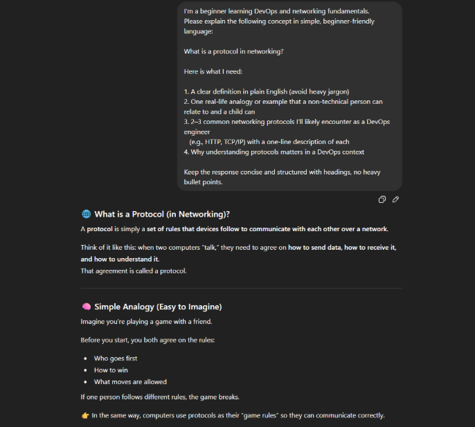
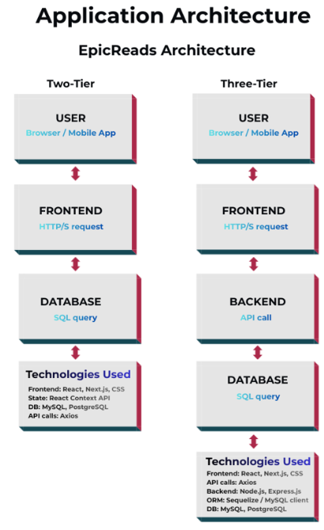
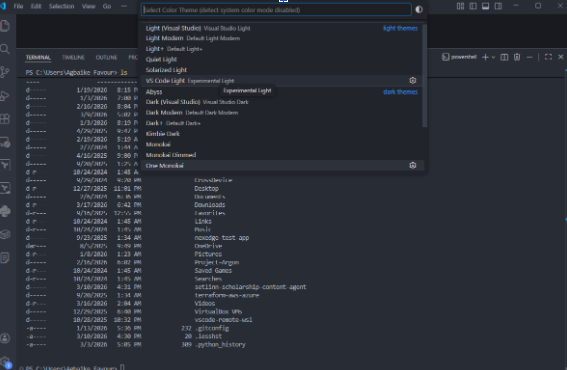

# Week 00 - Internet and Networking

Part of the DevOps Micro Internship (DMI) Cohort 3 with Agentic AI

---

# 🧑‍💻 Task 1: Using ChatGPT as Your Learning Assistant

## Scenario

You're new to DevOps and will frequently encounter technical questions. ChatGPT can be your learning companion.

## Your Task

Write a clear ChatGPT prompt to help you understand:

> "What is a protocol in networking? Explain with a simple real-life example."

Take a screenshot of your interaction showing:

- Your detailed prompt (with clear expectations)
- ChatGPT's simplified response with an example

## Screenshot



---

## What I Learned (2–3 lines)

I have realized that treating a prompt like a conversation rather than a 'search' makes all the difference. When I break things down into clear steps, I get a teammate instead of a robot, which turns a messy question into a solid plan.

---

# 🌐 Task 2: Internet and Networking

## Scenario

Your friend is launching an online bookstore named **EpicReads**.

He asked you to explain how users globally can access his website hosted in Finland.

## Your Task

Write a short explanation (**100–150 words**) that includes:

- Packet Switching
- IP Address
- TCP/IP
- HTTP/HTTPS

💡 **Tip:** You may use ChatGPT (as demonstrated in Task 1) to refine your explanation.

## Answer

Imagine your website is a shop in Finland. Every shop needs an address so people can find it. On the internet, that address is called an IP address. When someone types epicreads.com, the internet automatically finds your shop's address for them.

Now, when they click on a book, the information doesn't travel as one big package. It gets split into tiny pieces called packets, sent across underwater cables around the world, and reassembled perfectly on their screen, like a puzzle that rebuilds itself. This is called packet switching.

TCP/IP, on the other hand, is just the set of rules that makes sure every puzzle piece arrives safely and in the right order, nothing missing, nothing scrambled.

And HTTPS? Think of it as a locked envelope, it keeps your customers' passwords and payment details private and secure through encryption, while HTTP isn't secured.

---

# 🏗️ Task 3: Application Architecture & Stack

## Scenario

EpicReads bookstore has two application versions:

### Two-Tier Application

- Frontend
- Database

### Three-Tier Application

- Frontend
- Backend
- Database

## Your Task

- Draw simple diagrams (hand-drawn or tool-based such as draw.io)
- Label each layer clearly
- List at least two common technologies or tools used for each layer
- Submit a screenshot or photo clearly showing your own drawing

## Diagram Screenshot / Photo



---

## Technologies Used

### Frontend

- React
- HTML/CSS

### Backend

- Node.js
- Express

### Database

- MongoDB
- PostgreSQL

---

# 🌍 Task 4: Domain Name & DNS (Basic Concepts)

## Scenario

Your friend's bookstore **EpicReads** is currently accessible through:

```text
52.172.142.222:3000
```

He purchased the domain:

```text
epicreads.com
```

## Your Task

In **50–100 words**, explain in your own words:

1. What is DNS (Domain Name System)?
2. Which DNS record type should be used to connect the domain to the given IP, and why?

## Answer

DNS (Domain Name System) works like the internet's phone book. When someone types epicreads.com into their browser, DNS automatically looks up the IP address linked to that domain and directs them to the right server, just like searching a contact name to find their phone number.
To connect epicreads.com to the IP address 52.172.142.222, an A Record should be used. An A Record is specifically designed to map a domain name directly to an IPv4 address, which is exactly the format of the IP given.

---

# 💻 Task 5: Visual Studio Code Setup (Hands-on)

## Your Task

Install Visual Studio Code (if not already installed).

Take a screenshot of your VS Code environment showing:

- Terminal open inside VS Code
- Running a basic command:

### Windows

```powershell
dir
```

### Linux / macOS

```bash
pwd
ls
```

- Your selected VS Code theme clearly visible

⚠️ **Important:** The screenshot must show your username or another identifiable detail to confirm it is your environment.

## Screenshot



---

# 🔗 Task 6: Publish Your Assignment as a LinkedIn Post

## Objective

Publishing on LinkedIn helps you:

- Build your professional online presence
- Reinforce your learning
- Document your DevOps journey publicly

## Your Task

Summarize your answers from Tasks 1–5 into a LinkedIn post.

Clearly structure your post into the following sections:

- ChatGPT
- Internet & Networking
- App Architecture
- DNS
- VS Code Setup

Add the following credit note at the end of your post:

> **P.S. This post is part of the DevOps Micro Internship (DMI) with Agentic AI — Cohort 3 — by Pravin Mishra. My graded progress is public: https://dmi.pravinmishra.com/s/YOUR-GITHUB-USERNAME.html · Start your DevOps journey: https://dmi.pravinmishra.com/?utm_source=student&utm_medium=ps-linkedin&utm_campaign=cohort3**

---

## LinkedIn Post URL

https://www.linkedin.com/posts/favour-iruoghene-agbaike-6177ab236_devops-cloudengineering-networking-activity-7439741843614990337-BhIR?utm_source=share&utm_medium=member_desktop&rcm=ACoAADrZq7MBSujUP7_tlhkrVgRRMpJCFD9wPGY

---

## LinkedIn Post Backup Copy

Paste the full text of your LinkedIn post here:

Building EpicReads: Why the "basics" are actually the hard part

I've been spending some time revisiting internet architecture and DevOps fundamentals lately. And honestly? No matter how deep you go with cloud tools and infrastructure, everything still traces back to the same plumbing underneath.

Here are a few things that hit differently when you actually sit with them:

Your website is basically a very fast postal service.
When someone visits EpicReads, they're not downloading one big file. That page breaks into thousands of tiny packets, each one finding its own fastest route across undersea fibre cables, then reassembling perfectly on the other side. TCP/IP is essentially the world's most reliable postal worker, tracking every packet and resending anything that goes missing. Once you truly get packet switching, "latency" stops being a buzzword and starts being a physical problem you can actually reason about and solve.

The jump from 2-tier to 3-tier architecture is worth every bit of the extra setup.
A two-tier app is simple, your frontend talks directly to the database. Clean, fast to build. But the moment you want to scale, or you need your database to survive a bad UI push, that middle backend layer becomes non-negotiable. As a matter of fact, separation of concerns isn't just something you read about in a textbook. It's what stops a single database schema change from taking down your entire frontend at 2am.

DNS is quietly holding the internet together and nobody talks about it enough.
Nobody wants to type 52.172.142.222:3000 into a browser. That's exactly what DNS solves. An A record maps epicreads.com to that IP address so the whole thing feels effortless to the end user. It's invisible when it works, and absolutely catastrophic when it doesn't. If DNS breaks, everything stops,your site, your users and obviously your sleep.

Nothing beats actually building. VS Code is my go-to editor

At the end of the day, these aren't just "basics." They’re the foundation for debugging when things inevitably go sideways.

hashtag#DevOps hashtag#CloudEngineering hashtag#Networking hashtag#LearningInPublic hashtag#TechCommunity hashtag#AWS hashtag#Linux

P.S. This post is part of the FREE DevOps Micro Internship (DMI) Cohort 3 run by Pravin Mishra. You can start your DevOps journey for free from his YouTube Playlist: https://lnkd.in/djcWGjRX

---

# Reflection – Week 0

### What did you find easy?

Explaining the concepts once I broke them down into everyday analogies, like the postal service comparison, felt very natural.

---

### What was difficult?

Getting the DNS record type exactly right took a bit of research, since I wanted to be precise about why an A record specifically fits an IPv4 address.

---

### What will you improve next week?

I want to get faster at setting up my screenshots and organizing my folder structure from the start, rather than adjusting things afterward.

---

## 📌 About DMI & CloudAdvisory

DevOps Micro Internship (DMI) is a project-based DevOps program run by Pravin Mishra (The CloudAdvisory) focused on real-world execution, systems thinking, and career readiness.

It helps learners build strong DevOps foundations with hands-on experience.

## 📌 Resources

- 🌐 **DMI Official Website:** https://pravinmishra.com/dmi
- 🎓 **DevOps for Beginners (Udemy):** https://www.udemy.com/course/devops-for-beginners-docker-k8s-cloud-cicd-4-projects/
- 🎓 **Ultimate Agentic AI DevOps with Clude Code** https://www.udemy.com/course/ultimate-agentic-ai-devops-with-claude-code/?referralCode=448389767BC96284087B
- 🎓 **DevOps with Claude Code: Terraform, EKS, ArgoCD & Helm** https://www.udemy.com/course/devops-with-claude-code-terraform-eks-argocd-helm/?referralCode=1C5B734505D65A010FA3
- ▶️ **YouTube Playlist (DMI Cohort 3):** https://www.youtube.com/playlist?list=PLFeSNDtI4Cho
- 🔗 **Pravin Mishra (LinkedIn):** https://www.linkedin.com/in/pravin-mishra-aws-trainer/
- 🏢 **CloudAdvisory (LinkedIn):** https://www.linkedin.com/company/thecloudadvisory/

---

_This submission is part of DevOps Micro Internship (DMI) Cohort 3 — Agentic AI Track_
