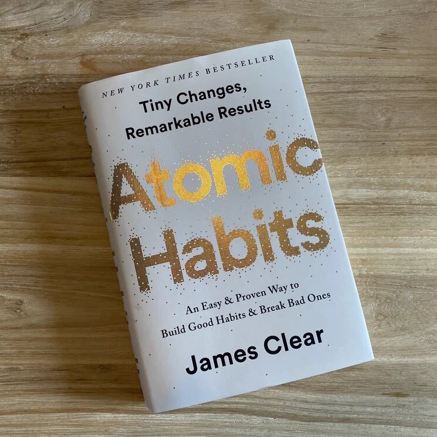
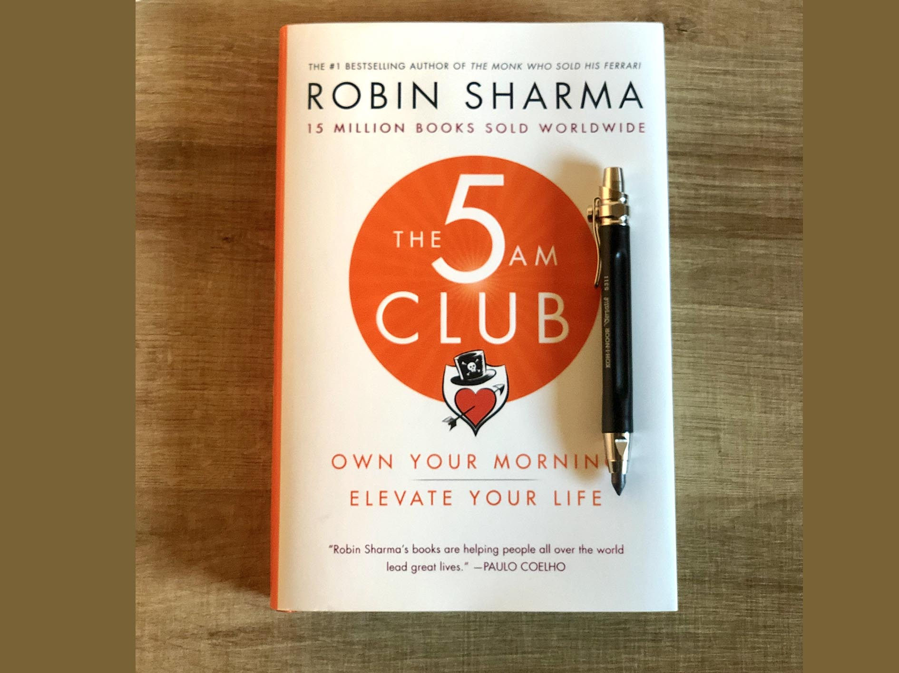
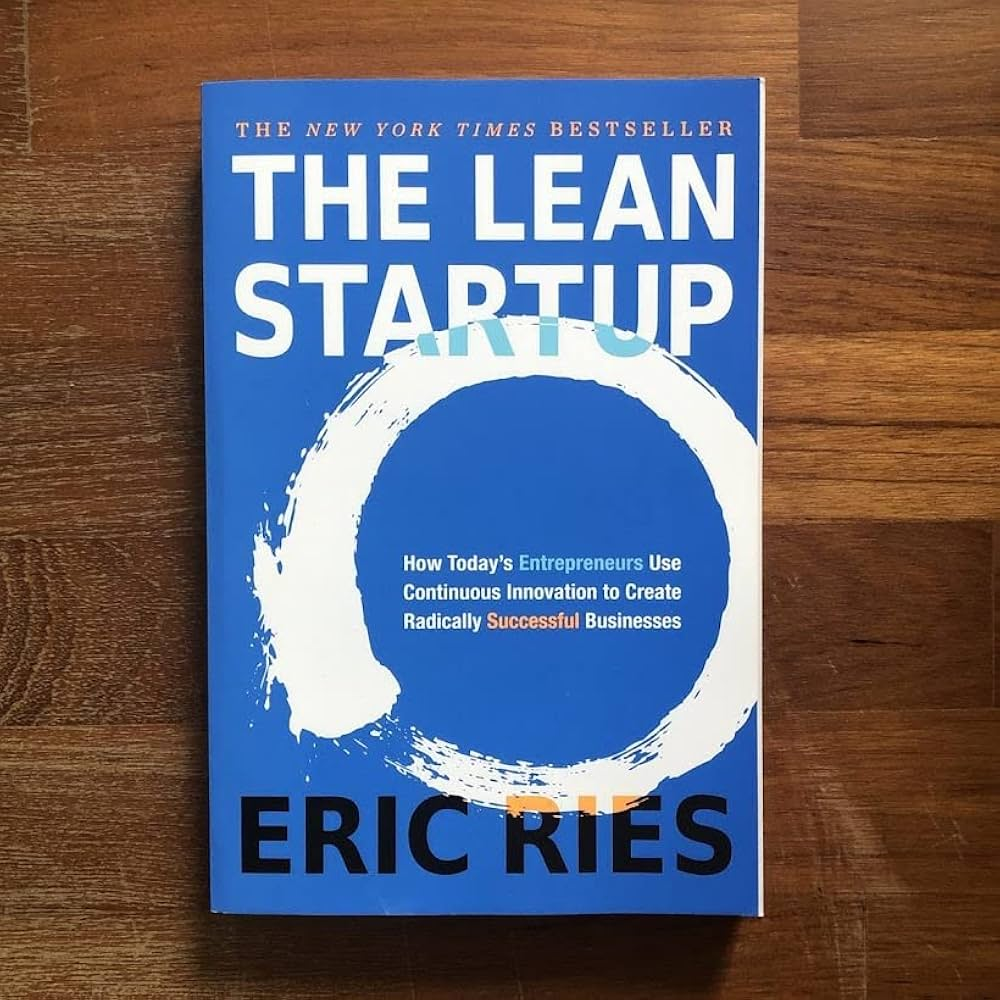
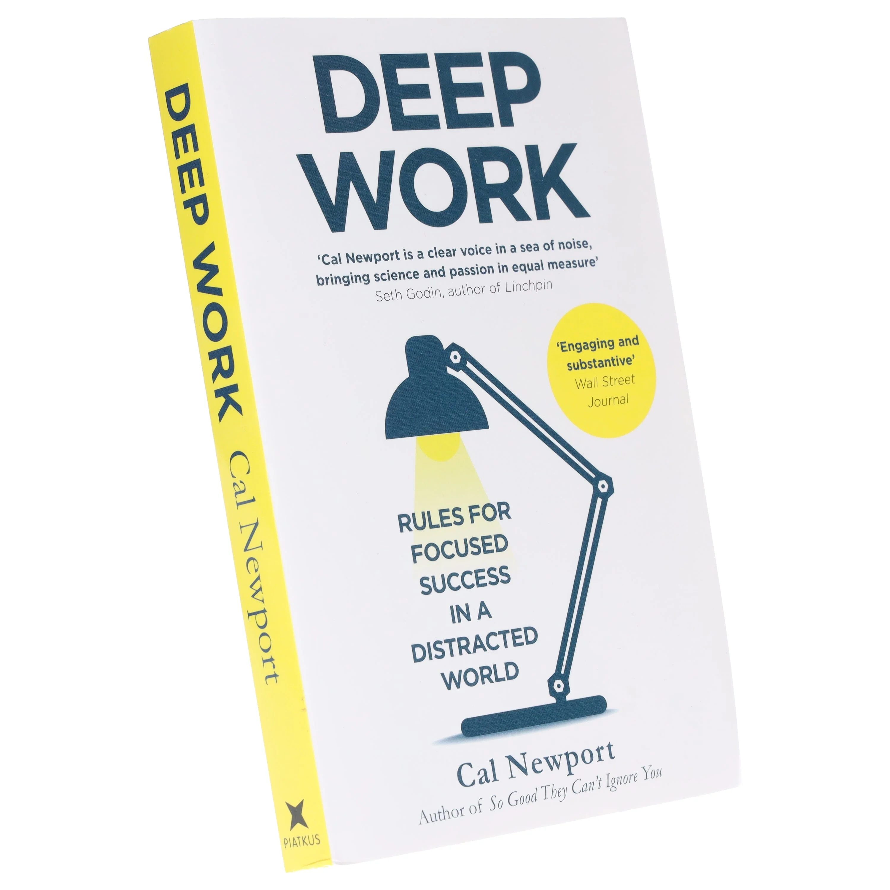

# Week 01 — Success Mindset (Mindset OS)

Part of the DevOps Micro Internship (DMI) Cohort 3 with Agentic AI

---

## Purpose (Read This First)

This week is not motivation homework.

This is you building your **Mindset OS** — the system you will use for the next 5 months (and honestly, for years).

### Expectations

- Be honest.
- Be specific.
- Be practical.
- Write like an adult professional: clear sentences, no one-liners.

You will reuse this in later weeks. So do it properly once.

---

# Assignment 1. What is something you believe to be true that most people around you would disagree with?

### Rules

- No "safe" answers.
- Must be your real belief (not copied from internet).
- Minimum 50 words.

**Hint:** What do you believe about career, money, learning, discipline, relationships, health, success, life, tech industry, etc. that most people don't agree with?

## Answer

I believe a relationship, or a life, can be genuinely peaceful without ever needing conflict, quarrelling, or misunderstanding to get there. Most people assume the opposite, that you have to go through bad relationships, fights, and painful experiences before you can appreciate or reach something good, that pain is somehow the price of wisdom. I don't believe that's true. If a relationship is built from the start on real communication, compassion, and true love, peace isn't something you arrive at after suffering, it's simply what's already there. Looking at life the way Jesus did, with love and understanding as the starting point rather than the reward at the end, peace becomes the natural outcome, not something earned through hardship first.

---

# Assignment 2. What are the top 3 objective truths you discovered through experimentation and results?

### Definition

Objective truths do not depend on opinions. They hold true regardless of how people feel.

Write each truth in this format:

**Truth:** (1 sentence)

**Evidence from my life:** (2–4 lines: what you tried + what happened)

---

## Truth #1

### Truth

Practice makes perfect, and through practice you gain mastery

### Evidence from my life

In an early support role, I had to learn how to handle cases spanning around 300 different topics, and at first I couldn't even fully grasp one of them. A lot of colleagues avoided taking on unfamiliar cases out of fear, but I kept accepting them and documenting what I learned each time. After about one year of that, I'd built real mastery, I could often diagnose a client's issue just from their description or a screen share, without needing to check the knowledge base articles at all.

---

## Truth #2

### Truth

The truth will always set you free.

### Evidence from my life

At a previous job, a product was found damaged and several of us who'd handled it were asked what happened. I told my manager exactly what condition it was in when I had it and where I'd left it, rather than adjusting my account to look safer. People doubted me at first, but when leadership pulled the CCTV footage, my version matched exactly, while others who'd given vague or false answers were caught out, including the person actually responsible. I ended up being recognized and put on a path toward more responsibility because of that, while the people who lied faced real consequences.

---

## Truth #3

### Truth

Procrastination kills, it destroys faster than anything.

### Evidence from my life

Whenever I told myself I'd study tomorrow instead of starting that day, tomorrow kept bringing something else, and the delay just repeated. The unfinished work piled up until I felt too overwhelmed to even begin, and what I did eventually finish was often rushed at the deadline instead of being my best effort.

---

# Assignment 3. What does your 2.0 version look like?

### Instructions

Write as if a journalist is writing about you **3 to 7 years from now** (not 20 years).

**Minimum 300 words.**

### Rules

- Write in past tense, like it already happened.
- Don't use "likes to / wants to / hopes to."
- Use specifics:
  - built
  - shipped
  - led
  - published
  - earned
  - relocated
  - contributed

- Include skills proof:
  - projects
  - portfolios
  - GitHub
  - blogs
  - certifications
  - job role
  - leadership
  - community contribution

- Add 1–3 images if you can (optional but powerful).

### Publish It Publicly On Any ONE

- LinkedIn
- Medium
- WordPress
- Blogspot
- Personal blog
- Portfolio page

Include this line:

> **P.S. This post is a part of DevOps Micro Internship with Agentic AI Cohort-3 by [Pravin Mishra](https://www.linkedin.com/in/pravin-mishra-aws-trainer/). You can start your DevOps journey by joining this [Discord community](https://discord.pravinmishra.com/) ( https://discord.pravinmishra.com/ ).**

## Your Article

From Bedside to the Cloud: How Favour Agbaike Built a Career That Changed Two Countries

When Favour Iruoghene Agbaike arrived in Berlin, she had originally planned to work in medtech. A language barrier quietly redirected that path, and what she found on the other side of that detour turned out to be something she loved far more than she had expected.
By 2030, Favour had become a certified multi-cloud engineer. She had completed her full Azure certification path, AZ-900 through AZ-305, and earned her professional cloud architect credentials across multiple cloud providers. She had also broken through the language barrier that once stood in her way, reaching C1 level in German, having moved through B1 and B2 steadily while building her cloud career in parallel. She was working in a medtech cloud role, exactly at the intersection she had always envisioned, where healthcare and technology meet.
Her technical portfolio told the story clearly. She had shipped a live e-commerce platform, Favourdome, on Azure Static Web Apps with an automated CI/CD pipeline through GitHub Actions, one of her earliest public proofs that she was not just studying cloud concepts but deploying them. On GCP, she designed and deployed a secure Landing Zone from scratch, built a Shared VPC architecture, enforced zero-trust networking, and provisioned a Private GKE cluster with Workload Identity, managing everything through Terraform including a clean state migration with no resource loss. On the AI side, she had shipped a Sales Co-Pilot on Relevance AI, a Lead Qualification Agent on N8N, a dual-channel Website and Phone Agent on Voiceflow, and a WhatsApp Lead Generation Agent on Agentive, all fully deployed, all documented on her GitHub at github.com/agbaike.
She published throughout the journey, sharing her real learning process, the errors, the breakthroughs, and the lessons she had to work through the hard way. That honesty built a following of people who trusted her voice.
She contributed to the DevOps community through the DMI Cohort 3 programme under Pravin Mishra, completed all fifteen weeks, and later mentored newer engineers entering cloud roles, passing forward the kind of patient support she had once needed herself.
But the work that carried the most meaning reached far beyond her own career. Favour founded a health technology company built around reproductive and fertility health, driven by a deep desire to be a solution to millions of people and to help families who were struggling to have children. She brought her technical knowledge into that mission fully, using cloud infrastructure and smart systems to make healthcare delivery seamless where it had previously been fragmented and out of reach.
By 2030 she had also built a hospital in Nigeria, a real, equipped, functioning facility, ensuring that the people of her nation had access to the medical care and technology they deserved. She bought her dream home in Nigeria in that same season, a milestone she had carried quietly in her heart for years.
Through all of it, she remained anchored in her faith. She sponsored Gospel outreach work as her influence and resources grew, and she built a home life that was exactly what she had prayed for, peaceful, full of love, and settled.
Favour Agbaike started from a detour. She built the road herself from there, and it led somewhere far greater than she had originally planned.

P.S. This post is a part of DevOps Micro Internship with Agentic AI Cohort-3 by Pravin Mishra. You can start your DevOps journey by joining this Discord community: https://discord.pravinmishra.com/

### Public Link

https://medium.com/@agbaikefavour/from-bedside-to-the-cloud-how-favour-agbaike-built-a-career-that-changed-two-countries-86e67fb42759

`__________________________`

---

# Assignment 4. Have you ever cut corners (unethical / dishonest / shortcut behavior — not necessarily illegal)? If yes, how did it make you feel?

### Important

You don't need to write the full story.

Focus on the feeling:

- guilt
- fear
- shame
- stress
- regret
- numbness
- etc.

This is about self-awareness, not judgment.

### Answer Format

**Yes / No**

If Yes:

**What emotion did you feel?** (minimum 50–100 words)

## Answer

No

---

# Assignment 5. What are 10 non-fiction books you plan to read in the next 1 year?

### Rules

- Mention **Title + Author**
- Any language allowed
- No fiction novels

### Tip

Choose books that improve:

- mindset
- communication
- productivity
- health
- money
- career
- leadership

## Book List

1. The Power of Your Mind by Pastor Chris Oyakhilome

   

2. How to Make Your Faith Work by Pastor Chris Oyakhilome
   

3. Recreating Your World by Pastor Chris Oyakhilome
   

4. Atomic Habits by James Clear
   

5. Boundaries by Dr. Henry Cloud and Dr. John Townsend
   

6. The 5 AM Club by Robin Sharma
   

7. Rich Dad Poor Dad by Robert Kiyosaki
   

8. The Lean Startup by Eric Ries
   

9. ADeep Work by Cal Newport
   
   
10. Good Morning, Holy Spirit by Benny Hinn
    

---

# Assignment 6. What are the things you will measure regularly in your life and career?

### Rules

List topics only. No need to share numbers.

### Must Include

- Learning / skill
- Output / proof
- Health / energy
- Time / focus
- Money / finance (personal or business)

### Example

- Learning hours per week
- Deep work sessions per week
- Projects shipped / documented
- Steps / workouts
- Sleep hours
- Spending tracker

## My Metrics

- DMI assignments completed per week
- Projects shipped or documented on GitHub
- Blog posts or LinkedIn posts published
- CV and job application activity tracked weekly
- Workout or walk sessions per week
- Sleep hours per night
- Self-care time per week
- Deep work focus blocks completed per week
- Spiritual life and devotion time per week
- Family and friends connection time per week
- Investment contributions tracked monthly
- Monthly expenses reviewed against savings target

---

# Assignment 7. Brain Dump + 5-Month System Plan

## Step 1: Brain Dump (Private)

Do a brain dump of everything in your mind into a notebook.

Examples:

- Bills
- Tasks
- Worries
- Goals
- Pending messages
- Ideas
- Responsibilities

### Did You Do It?

**Yes / No**

Answer:

Yes, completed in a digital notebook.

---

## Step 2: Your 5-Month Routine + Focus Blocks

Create a simple plan you can realistically follow for the next 5 months.

### Weekly Routine

Example:

- Mon–Thu: 60 min deep work
- Sat: DMI session
- Sun: Weekly review

#### My Weekly Routine

- Monday to Saturday: 30 minutes during work break time for DMI reading or German language practice
- Saturday: DMI live session where possible
- Sunday evenings: main DMI work day, review Saturday's session, work on assignments in 30-60 minute focused blocks with short breaks in between

---

### Focus Blocks

#### When Will You Do DMI Work? (Days + Time)

Sunday evenings, plus work break times during the week

#### How Many Sessions Per Week?

One main session on Sunday plus short daily bursts of 30 minutes during weekday breaks

---

### Distraction Rules

Examples:

- Phone rules
- Social media rules
- Environment setup

#### My Distraction Rules

- Phone on silent during Sunday DMI sessions Phone rules
- Social media only after completing the day's assignment block
- Maximum 30 minutes per reading or study session, then a break
- Use commute time for German language app practice

---

# Reflection – Week 1

### Biggest insight I got about myself this week

I realised that I don't need hours of free time to make progress. Even two, five, or ten minutes done consistently and tracked toward a clear goal is enough to move forward. I have been waiting for big blocks of time that rarely come, when small intentional moments were always available.

### My biggest weakness/loop I noticed

Procrastination driven by exhaustion. When I feel tired I tell myself I will do it tomorrow, tomorrow brings the same feeling, and the task piles up until it becomes overwhelming. I either miss it entirely or rush it at the last minute without giving it my best.

### One system I will implement from this week (exact habit + time)

I will stop procrastination by committing to doing something, even for just one to five minutes, no matter how tired I feel. The goal is not the duration but building the habit and the identity of someone who starts. I will do this every evening before I sleep, even if it is simply opening my notes and writing one line.

### LinkedIn Post

https://www.linkedin.com/posts/favour-iruoghene-agbaike-6177ab236_devops-cloudengineering-it-share-7476606880665198592-iib6/?utm_source=share&utm_medium=member_desktop&rcm=ACoAADrZq7MBSujUP7_tlhkrVgRRMpJCFD9wPGY
`__________________________`

---

## 10. Proof of Work

- LinkedIn Post URL: **[https://www.linkedin.com/posts/favour-iruoghene-agbaike-6177ab236_devops-cloudengineering-it-share-7476606880665198592-iib6/?utm_source=share&utm_medium=member_desktop&rcm=ACoAADrZq7MBSujUP7_tlhkrVgRRMpJCFD9wPGY]**
- Blog / Medium : **[https://medium.com/@agbaikefavour/from-bedside-to-the-cloud-how-favour-agbaike-built-a-career-that-changed-two-countries-86e67fb42759]**

---

## 📌 About DMI & CloudAdvisory

DevOps Micro Internship (DMI) is a project-based DevOps program run by Pravin Mishra (The CloudAdvisory) focused on real-world execution, systems thinking, and career readiness.

It helps learners build strong DevOps foundations with hands-on experience.

## 📌 Resources

- 🌐 **DMI Official Website:** https://pravinmishra.com/dmi
- 🎓 **DevOps for Beginners (Udemy):** https://www.udemy.com/course/devops-for-beginners-docker-k8s-cloud-cicd-4-projects/
- 🎓 **Ultimate Agentic AI DevOps with Clude Code** https://www.udemy.com/course/ultimate-agentic-ai-devops-with-claude-code/?referralCode=448389767BC96284087B
- 🎓 **DevOps with Claude Code: Terraform, EKS, ArgoCD & Helm** https://www.udemy.com/course/devops-with-claude-code-terraform-eks-argocd-helm/?referralCode=1C5B734505D65A010FA3
- ▶️ **YouTube Playlist (DMI Cohort 3):** https://www.youtube.com/playlist?list=PLFeSNDtI4Cho
- 🔗 **Pravin Mishra (LinkedIn):** https://www.linkedin.com/in/pravin-mishra-aws-trainer/
- 🏢 **CloudAdvisory (LinkedIn):** https://www.linkedin.com/company/thecloudadvisory/

---

_This submission is part of DevOps Micro Internship (DMI) Cohort 3 — Agentic AI Track_
