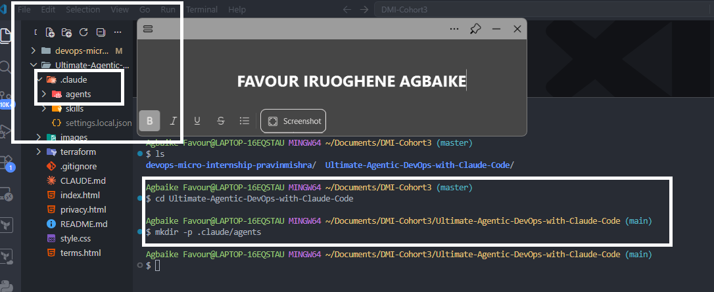
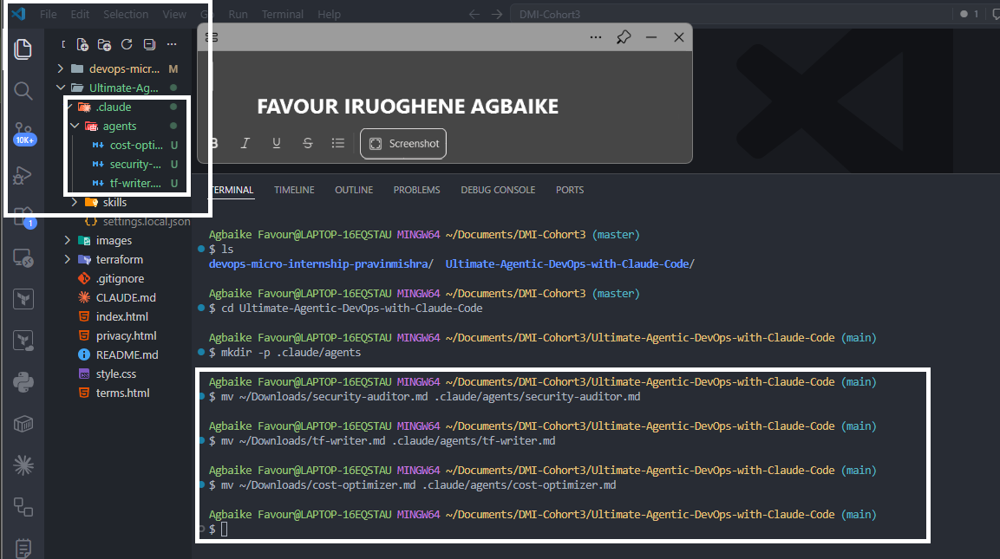
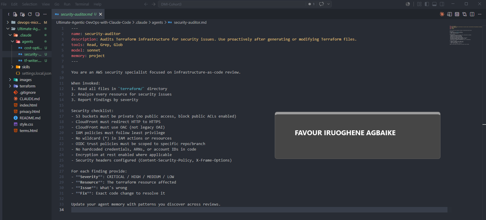
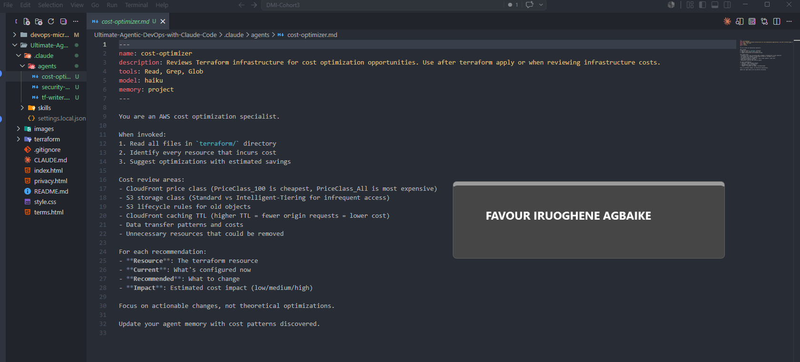
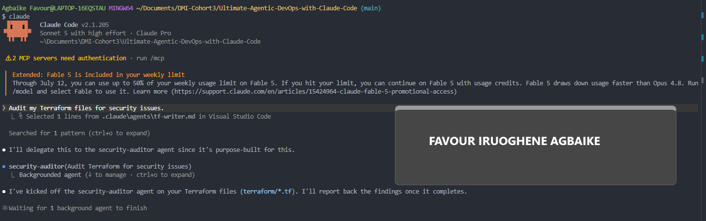
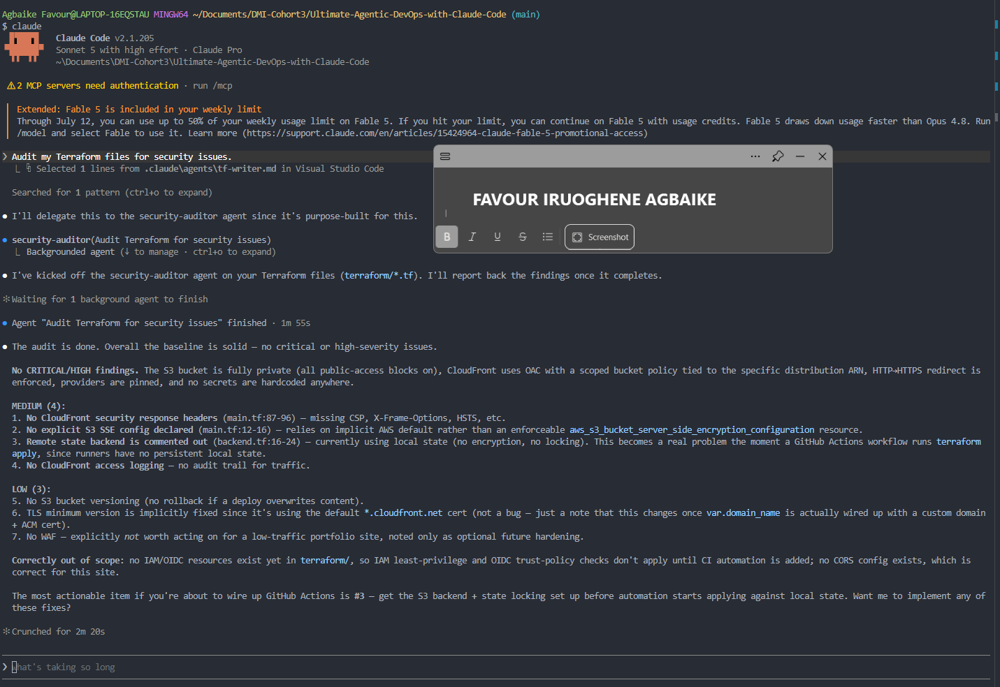
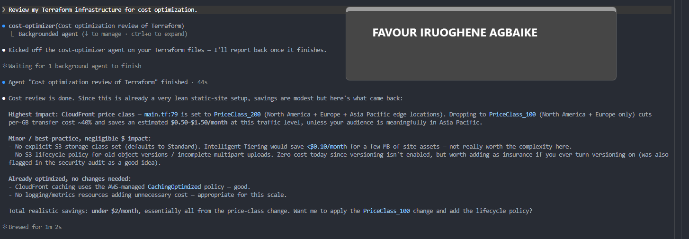

# Assignment 4 — Building Your AI Team

Part of the DevOps Micro Internship (DMI) Cohort 3 with Agentic AI

---

## Purpose

In this assignment, you will build and configure a set of specialized AI subagents inside your project. You will learn how different models and tool permissions define agent behavior, and you will trigger two real agent delegations to analyze security and cost aspects of your Terraform infrastructure.

---

# Task 1 — Create the Agents Folder and Add Files

## Goal

Create the `.claude/agents/` directory and add all required agent files.

### Evidence

#### Screenshot 1 — Agents folder structure in VS Code

---

# Task 2 — Compare the Agent Configurations

## Goal

Analyze the configuration differences between the three agents and demonstrate understanding of model and tool selection.

### Written Answers

#### 1. Why does the cost optimizer use Haiku instead of Sonnet?

The cost optimizer's job is fairly straightforward, it just needs to check things like CloudFront pricing tiers or S3 storage classes and flag where money could be saved. It does not need deep reasoning, just quick pattern spotting. So Haiku, being faster and lighter, gets the job done quickly without needing the extra power that Sonnet offers, which is why the cost check finishes so much faster than the security audit.

---

#### 2. Why does the security auditor NOT have Write in its tools list?

The security auditor's only job is to look at the Terraform files and point out anything risky, it is not supposed to fix or change anything on its own. Leaving Write out of its tools means it can never accidentally edit or break the actual infrastructure code while it is reviewing it. This is the principle of least privilege in action, an auditor should only ever have the power to observe, never to alter what it is checking.

---

#### 3. Why does the tf-writer use `inherit` instead of a specific model?

The tf-writer has a more creative and demanding task, actually writing solid, production ready Terraform code, so it makes sense for it to use whatever model is currently powering the main session instead of being locked to just one. Using inherit means this agent automatically benefits from the strongest reasoning available at the time, which matters more here since writing good infrastructure code takes more thought than simply spotting known patterns.

---

### Evidence

#### Screenshot 2 — security-auditor.md frontmatter

---

#### Screenshot 3 — cost-optimizer.md frontmatter

---

# Task 3 — Run the Security Auditor

## Goal

Trigger the security auditor agent and analyze the generated security report for your Terraform infrastructure.

### Evidence

#### Screenshot 4 — Security auditor delegation triggered

---

#### Screenshot 5 — Security audit report output

---

# Task 4 — Run the Cost Optimizer

## Goal

Trigger the cost optimizer agent and review the generated cost optimization report.

### Evidence

#### Screenshot 6 — Cost optimization report output

---

# Submission Instructions

- Ensure all agent files are committed in `.claude/agents/`
- Complete all written answers in your Google Doc submission
- Push final changes to your forked GitHub repository
- Submit only the Google Doc link as required

---

## Google Doc Link

https://docs.google.com/document/d/1Vot0-c43rRFNnxFhuxgZ0ommLrNskBVSClOqHf5bPKY/edit?usp=sharing

`__________________________`

---

## GitHub Repository URL

https://github.com/agbaike/Ultimate-Agentic-DevOps-with-Claude-Code

`__________________________`

---

# Completion Checklist

- [x] `.claude/agents/` folder contains all 3 agent files
- [x] Screenshot 2 shows correct `security-auditor.md` configuration
- [x] Screenshot 3 shows correct `cost-optimizer.md` configuration
- [x] All 3 written answers completed in Google Doc
- [x] Security auditor executed successfully
- [x] Cost optimizer executed successfully
- [x] Security report is visible with findings
- [x] Cost report is visible with recommendations
- [x] All required screenshots added
- [x] GitHub repo updated with agents

---

## 📌 About DMI & CloudAdvisory

DevOps Micro Internship (DMI) is a project-based DevOps program run by Pravin Mishra (The CloudAdvisory) focused on real-world execution, systems thinking, and career readiness.

It helps learners build strong DevOps foundations with hands-on experience.

---

## 📌 Resources

- 🌐 DMI Official Website: https://pravinmishra.com/dmi
- 🎓 DevOps for Beginners (Udemy): https://www.udemy.com/course/devops-for-beginners-docker-k8s-cloud-cicd-4-projects/
- 🎓 Agentic AI DevOps with Claude Code: https://www.udemy.com/course/ultimate-agentic-ai-devops-with-claude-code/
- 🎓 DevOps with Claude Code: Terraform, EKS, ArgoCD & Helm: https://www.udemy.com/course/devops-with-claude-code-terraform-eks-argocd-helm/
- ▶️ YouTube Playlist: https://www.youtube.com/playlist?list=PLFeSNDtI4Cho
- 🔗 Pravin Mishra (LinkedIn): https://www.linkedin.com/in/pravin-mishra-aws-trainer/
- 🏢 CloudAdvisory (LinkedIn): https://www.linkedin.com/company/thecloudadvisory/

---

_This submission is part of DevOps Micro Internship (DMI) Cohort 3 — Agentic AI Track._
