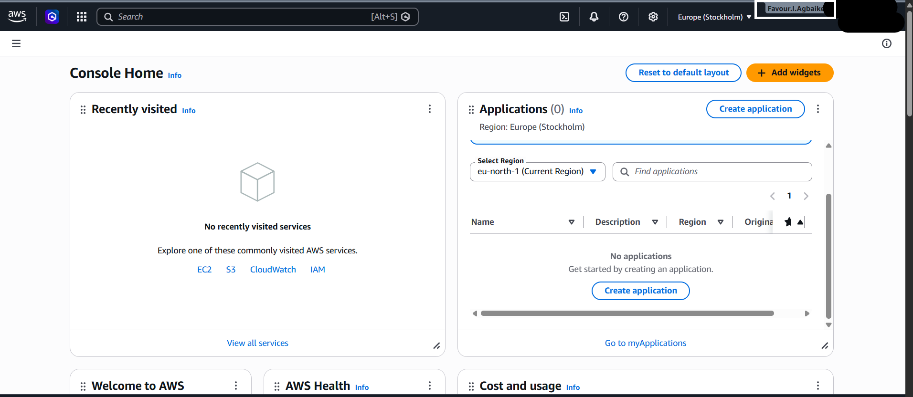

# Assignment 1 — AWS Free Tier Account Setup (EpicReads Cloud Onboarding)

Part of the DevOps Micro Internship (DMI) Cohort 3 with Agentic AI

---

## Purpose

In this assignment, you will create and verify an AWS Free Tier account as part of onboarding EpicReads — an online bookstore moving to the cloud. You will demonstrate an understanding of AWS fundamentals, Free Tier services, and account setup by answering conceptual questions and capturing proof of a working AWS Console login.

---

# Task 1 — Understanding AWS & Free Tier

## Goal

Demonstrate understanding of AWS basics and Free Tier usage by answering the following questions in your own words (3–4 lines each).

### Answers

#### Question 1 — What is an AWS account, and why do you need it at this stage?

I need an AWS account right now mainly so I can actually practice hands-on instead of just reading theory. This course keeps giving us real exercises to deploy, and none of that works without an account. Longer term, I want to be able to build my own real projects too, so getting comfortable with this now, at this early stage, feels like the right foundation to start from.

---

#### Question 2 — What is AWS Free Tier, and how long does it last?

AWS Free Tier is a program that lets new AWS customers try out cloud services without paying anything at first. It used to give new accounts 12 months of free usage on many services, but that changed in mid-2025. Now, when someone signs up, the person gets $100 in credit right away, and can earn up to $100 more by completing a few starter tasks, up to $200 in total. Should the person pick the Free plan, the account automatically closes after 6 months, or once that credit runs out, whichever comes first. There are also separate 'Always Free' services that never expire at all, no matter which plan someone picks, as long as usage stays within their limits."

---

#### Question 3 — Name three AWS Free Tier services and their free usage limits.

Three services I looked into are EC2, S3, and DynamoDB. EC2 is basically a virtual server, and in the past you got 750 hours a month of a small one for free, for a whole year. Now that's changed a bit, it comes out of the sign up credit instead. S3 is for storage, same thing, it used to be 5GB free for a year, now it also pulls from that credit, but there's still a small amount that stays free regardless. DynamoDB is the one I liked most when I read about it, it's a database, and it's actually free forever, not just for a year, you get 25GB of storage and enough capacity for a small app, and that doesn't expire no matter when you signed up.

---

# Task 2 — Create AWS Free Tier Account

## Goal

Create a valid AWS Free Tier account and sign in to the AWS Management Console.

> No screenshots required for this task. Completion is verified through Task 3.

---

# Task 3 — Verify AWS Account

## Goal

Confirm that your AWS account setup is complete by navigating to the Account section and capturing proof.

### Evidence

#### Screenshot 1 — AWS Account page showing account name (email may be blurred)

---

# Submission Instructions

- Add all required screenshots in your GitHub repository submission
- Full name must be visible in required screenshots
- Do not expose sensitive information (keys, passwords, account IDs)

---

# Completion Checklist

- [x] Task 1 answers written in own words
- [x] AWS Free Tier account created successfully
- [x] Signed in to AWS Management Console
- [x] Screenshot of AWS Account page captured (full name visible, no sensitive data)
- [x] All required screenshots added to repository

---

## 📌 About DMI & CloudAdvisory

DevOps Micro Internship (DMI) is a project-based DevOps program run by Pravin Mishra (The CloudAdvisory) focused on real-world execution, systems thinking, and career readiness.

It helps learners build strong DevOps foundations with hands-on experience.

---

## 📌 Resources

- 🌐 DMI Official Website: https://pravinmishra.com/dmi
- 🎓 DevOps for Beginners (Udemy): https://www.udemy.com/course/devops-for-beginners-docker-k8s-cloud-cicd-4-projects/
- 🎓 Agentic AI DevOps with Claude Code: https://www.udemy.com/course/ultimate-agentic-ai-devops-with-claude-code/
- 🎓 DevOps with Claude Code: Terraform, EKS, ArgoCD & Helm: https://www.udemy.com/course/devops-with-claude-code-terraform-eks-argocd-helm/
- ▶️ YouTube Playlist: https://www.youtube.com/playlist?list=PLFeSNDtI4Cho
- 🔗 Pravin Mishra (LinkedIn): https://www.linkedin.com/in/pravin-mishra-aws-trainer/
- 🏢 CloudAdvisory (LinkedIn): https://www.linkedin.com/company/thecloudadvisory/

---

_This submission is part of DevOps Micro Internship (DMI) Cohort 3 — Agentic AI Track._
