# Assignment 3 — Production Maintenance Drill (OPS Checklist)

Part of the DevOps Micro Internship (DMI) Cohort 3 with Agentic AI

---

## Purpose

In this assignment, you will treat your already deployed React application (on Ubuntu VM with Nginx) as a live production system. You will perform structured operational checks covering network validation, service health, log analysis, resource monitoring, configuration verification, and incident simulation with recovery — mirroring real on-call DevOps responsibilities.

---

# Task 1 — Server Access & Networking Validation

## Goal

Verify that the deployed React application is reachable from the browser and confirm basic network connectivity of the Ubuntu VM.

### Evidence

#### Screenshot 1 — Browser showing the React app with your Full Name visible on the UI

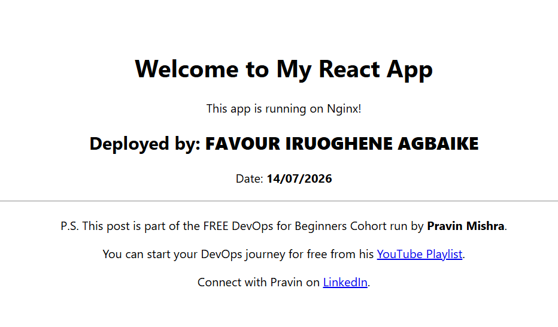

---

#### Screenshot 2 — Output of `ip a`

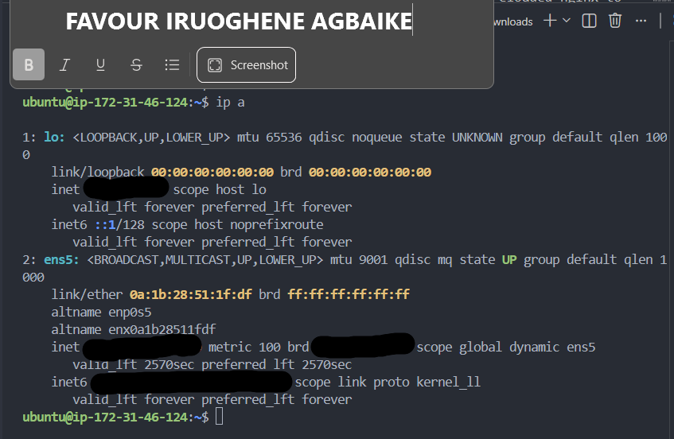

---

#### Screenshot 3 — Output of `sudo ss -tulpen`

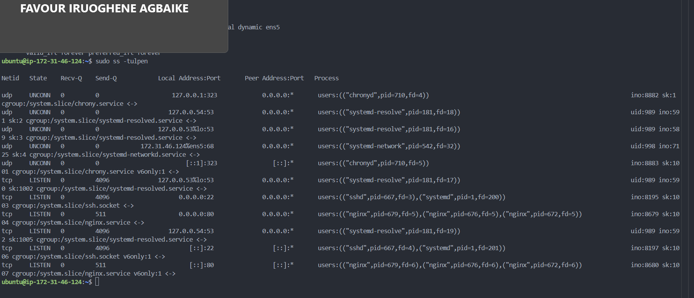

---

#### Screenshot 4 — Output of `sudo ufw status`

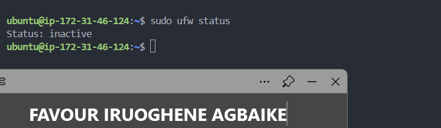

---

### Notes

Answer the following in your own words:

**1. What proves Nginx is listening on 0.0.0.0:80?**

When I ran sudo ss -tulpen, the output showed a line with tcp LISTEN 0.0.0.0:80, and the process next to it was nginx. That 0.0.0.0 part is really the key detail here, it proves nginx isn't just listening locally on the server, it's listening on all network interfaces. That's exactly why the app is reachable from the public internet, and not just from inside the server itself.

---

**2. What proves SSH is active on port 22?**

That same ss -tulpen output also had a line showing tcp LISTEN 0.0.0.0:22, with sshd as the process. This confirms SSH is actively listening for connections on port 22, across all interfaces, which honestly makes sense, since that's literally how I've been connecting into this server remotely this whole time.

---

**3. Did you find any unexpected open ports? Explain briefly.**

No, nothing unexpected came up. Besides nginx on port 80 and SSH on port 22, the only other listening ports belonged to internal services like systemd-resolve, which handles DNS resolution, and chronyd, which handles time synchronization. Both of these were only bound to localhost addresses like 127.0.0.1 or 127.0.0.54, meaning they're not reachable from outside the server at all. Everything I found lined up exactly with what should be running on this instance.

---

# Task 2 — Service Health & Systemd Validation (Nginx)

## Goal

Verify that Nginx is properly installed, running, enabled at boot, and safely configured.

### Evidence

#### Screenshot 1 — Output of `systemctl status nginx --no-pager`

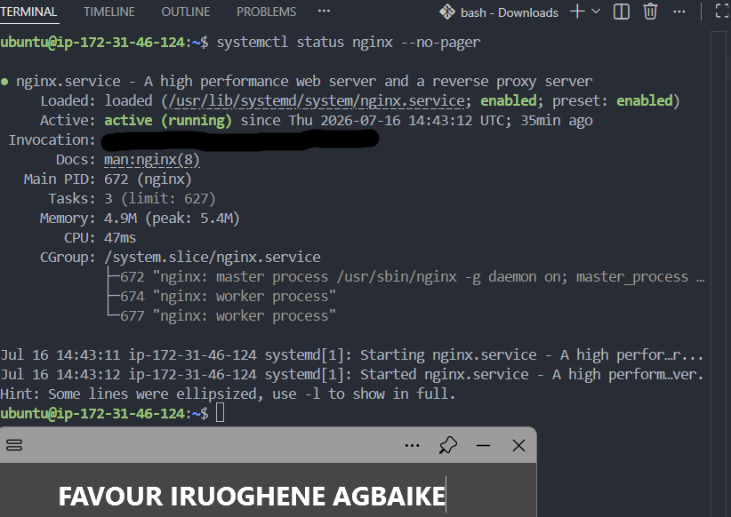

---

#### Screenshot 2 — Output of `sudo nginx -t`

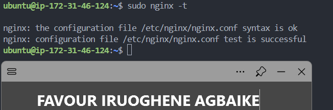

---

#### Screenshot 3 — Output of `sudo ss -lptn '( sport = :80 )'`

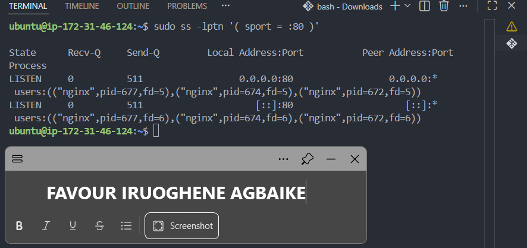

---

### Notes

Answer the following in your own words:

**1. What happens if Nginx fails to restart in production?**

If nginx fails to restart, the website just goes down. Nginx is the thing actually serving the app to people, so if it's not running, anyone trying to visit gets an error instead of the app loading. It stays broken until someone either restarts it or fixes whatever caused it to fail in the first place, usually a mistake in the config file. That's exactly why I always check sudo nginx -t first, before restarting anything, so I catch mistakes before they take the whole site down.

---

**2. What's your basic rollback plan?**

My plan would be simple. First, check sudo nginx -t to see if the config file itself has an error. If it does, I go back and undo whatever I just changed, ideally I'd have kept a backup of the working version before touching anything, so I can just put that back. Once the config passes the test again, I restart nginx and check systemctl status nginx to make sure it says active. Then I'd actually open the site in my browser too, just to be sure it's really working, not just technically 'running.

---

# Task 3 — Logs & Request Trace

## Goal

Verify real traffic flow and analyze logs to understand system behavior and errors.

### Evidence

#### Screenshot 1 — Output of `sudo tail -n 30 /var/log/nginx/access.log`

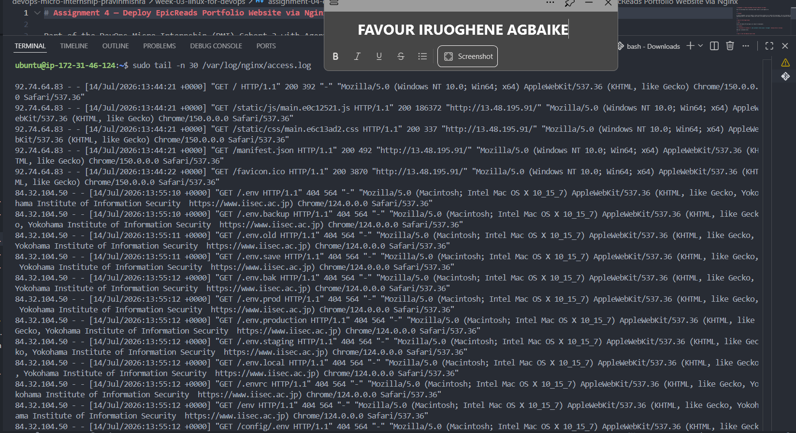

---

#### Screenshot 2 — Output of `sudo tail -n 30 /var/log/nginx/error.log`

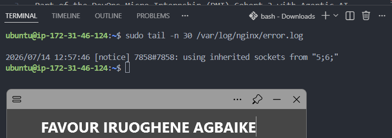

---

#### Screenshot 3 — Output of `sudo journalctl -u nginx --no-pager -n 50`

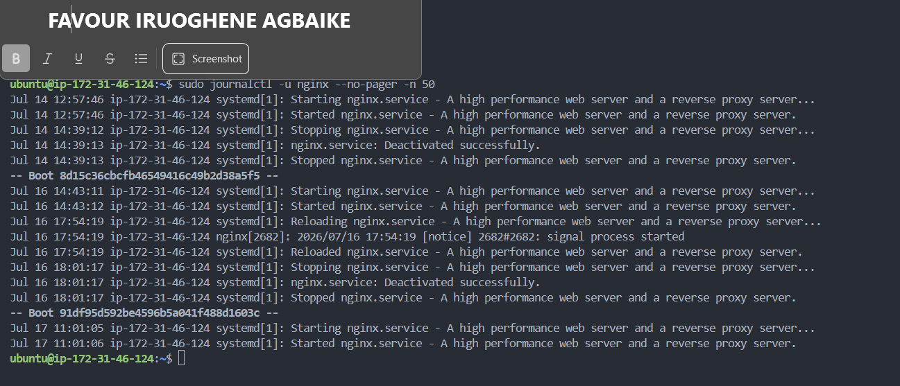

---

### Notes

Answer the following in your own words:

**1. Were there any errors in the logs?**

- If yes, mention 1–2 example error lines from the logs and explain what each one means in simple terms.
- If no, explain what it means if the error log is empty or shows no recent errors during your check.

The error log itself was basically empty, it only had one line saying 'using inherited sockets,' which isn't really an error, it's just a normal notice from when nginx restarted. But looking at the access log, I did see some interesting entries. On July 14, there's a bunch of requests from one IP address trying to find files like .env, .env.backup, and .env.production. These all came back as 404, meaning not found, which is good, it means those files don't exist on my server. This looks like an automated bot scanning for exposed secret files, something that happens constantly on the internet to any public server, not something specific to me doing anything wrong.

---

**2. If there were no errors, what does that indicate about the system?**

An empty error log is actually a good thing, it just means nginx has been running smoothly, no crashes, nothing broken. Those scanning attempts I saw aren't really errors either, they're just random bots poking around, and my server correctly told them 'not found' every single time, which is exactly what should happen

---

**3. Based on the access logs, were your curl requests visible in the log entries? What does that prove about traffic flow?**

Yes, I could see my own curl requests right there in the log, shown as ::1, which just means the server talking to itself, with curl listed as the tool. That tells me the whole thing is actually working properly, when I send a request, nginx picks it up, logs it, and responds, and I can literally see that happen in the logs.

---

# Task 4 — System Resource Health Check (Capacity Red Flags)

## Goal

Assess server capacity and detect potential performance or failure risks.

### Evidence

#### Screenshot 1 — Output of `uptime`

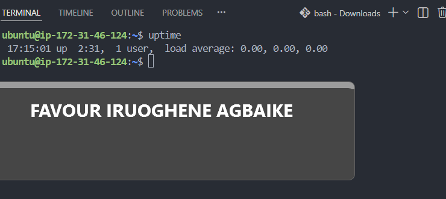

---

#### Screenshot 2 — Output of `free -h`

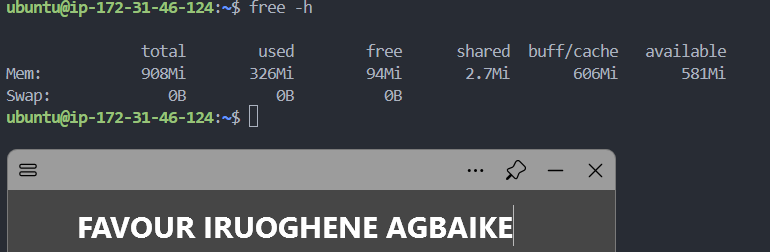

---

#### Screenshot 3 — Output of `df -h`

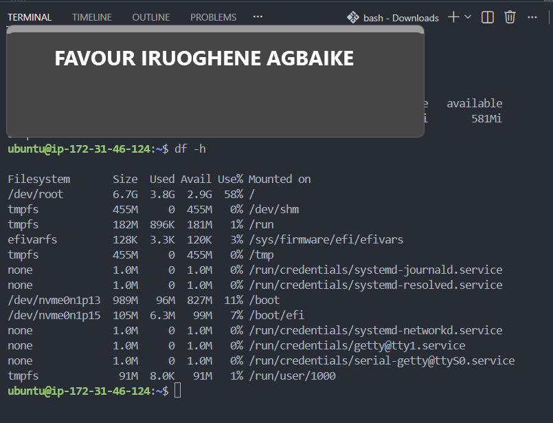

---

#### Screenshot 4 — Output of `sudo du -sh /var/* | sort -h`

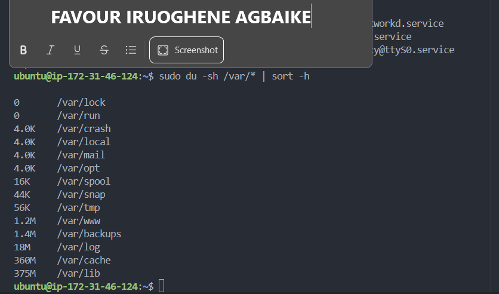

---

### Notes

Answer the following in your own words:

**1. Which resource looks most critical right now? (CPU/load, memory, or disk) Explain why.**

Looking at the three, none of them are actually critical right now. CPU load is at zero, so that's completely fine. Disk is at 58% used, which is okay for now, but worth watching since it slowly fills up over time. Memory looked a bit confusing at first, since 'used' shows 326MB and 'buff/cache' shows 606MB, which made it look like memory was almost full. But buff/cache is just Linux temporarily holding onto file data in case it's needed again soon, it's not actually locked up, Linux can free it instantly if something else needs the space. The number that actually matters is 'available,' which shows 581MB still free to use. So overall, nothing here is critical, but if I had to watch one thing over time, it would be disk space, since that's the one that only grows in one direction.

---

**2. What happens if disk becomes 100% full in a production server?**

If the disk fills up completely, the server basically can't create or save anything new. Logs stop being written, temporary files can't be created, and depending on what the app is doing, it might crash or just quietly fail without an obvious error message. For nginx specifically, if the disk is full, it might not be able to log incoming requests properly, or fail while trying to write something it needs. So running out of disk space isn't just a small inconvenience, it can genuinely bring a live production server down.

---

# Task 5 — Configuration & Deployment Verification

## Goal

Ensure the correct React build is deployed and Nginx is serving it properly.

### Evidence

#### Screenshot 1 — Output of `ls -lah /var/www/html | head -n 20`

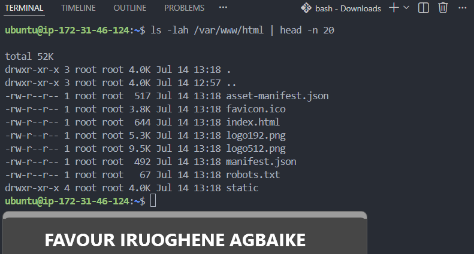

---

#### Screenshot 2 — Output of `grep -R "Deployed by" -n /var/www/html 2>/dev/null | head`

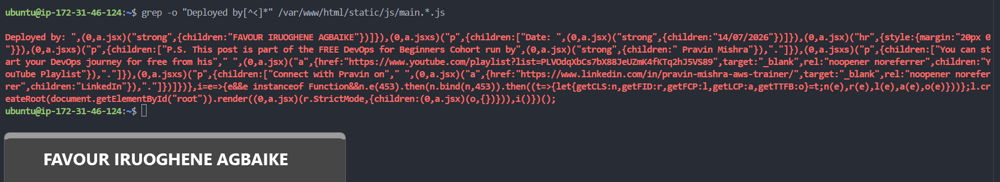

---

#### Screenshot 3 — Output of `grep -n "try_files" /etc/nginx/sites-available/default`

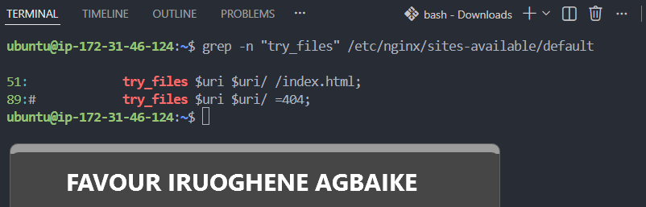

---

### Notes

Answer the following in your own words:

**1. How do you confirm that the correct version of the application is deployed?**

I confirmed it by searching directly inside the compiled JavaScript file that nginx is serving, using grep to look for the text 'Deployed by'. It came back showing my exact name, FAVOUR IRUOGHENE AGBAIKE, and today's date, right there in the actual file being served to visitors. I also checked the ls output of /var/www/html to confirm the build files themselves were sitting in the right place, and confirmed the nginx config's try_files line was correctly pointing back to index.html for proper React routing. Between all three of these, I could be confident the exact version I built, with my own personalization in it, is genuinely what's live right now.

---

# Task 6 — Nginx Configuration Failure Simulation

## Goal

Simulate a real-world Nginx misconfiguration and recover the service safely.

### Evidence

#### Screenshot 1 — Output of `sudo nginx -t` showing the syntax error (broken config)

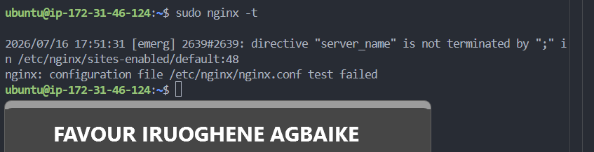

---

#### Screenshot 2 — Output of `sudo nginx -t` showing syntax ok (fixed config)

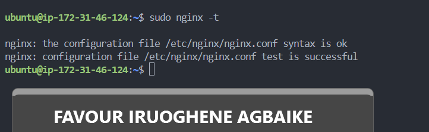

---

#### Screenshot 3 — Output of `curl -I http://<public-ip>` confirming recovery (200 OK)

---

### Notes

Answer the following in your own words:

**1. What caused the configuration failure?**

I intentionally removed the semicolon at the end of the server_name line in the nginx config file. In nginx config syntax, every directive line needs to end with a semicolon, without it, nginx can't tell where that instruction ends, so it throws a syntax error and refuses to load the config at all.

---

**2. How did you fix the issue?**

Before making the change, I had already created a backup copy of the working config file using cp. Once I confirmed the broken config failed the nginx -t test, I simply copied that backup file back over the broken one, then ran nginx -t again to confirm it passed, and reloaded nginx to apply it.

---

**3. How can you avoid this kind of issue in real production systems?**

The biggest habit that prevents this is always running sudo nginx -t after editing a config file, before reloading or restarting nginx. This test catches syntax errors before they ever actually get applied, so a small typo never takes down a live site. Keeping a backup copy of a known-working config before making any changes is also a simple, reliable safety net, since it means recovery is just a quick copy command away rather than trying to remember or rebuild the correct configuration from scratch.

---

# Task 7 — Web Application Failure Simulation

## Goal

Simulate missing deployment content and recover the application safely.

### Evidence

#### Screenshot 1 — Output of `curl -I http://<public-ip>` showing failure (non-200 response)

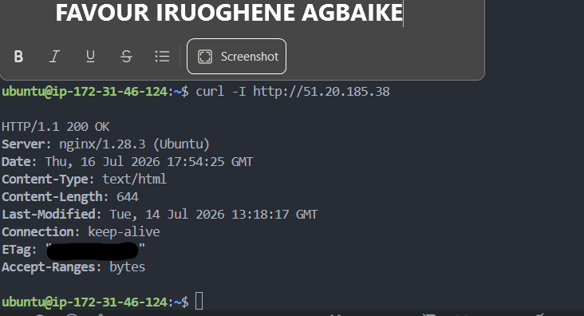

---

#### Screenshot 2 — Output of `curl -I http://<public-ip>` confirming recovery (200 OK)

## 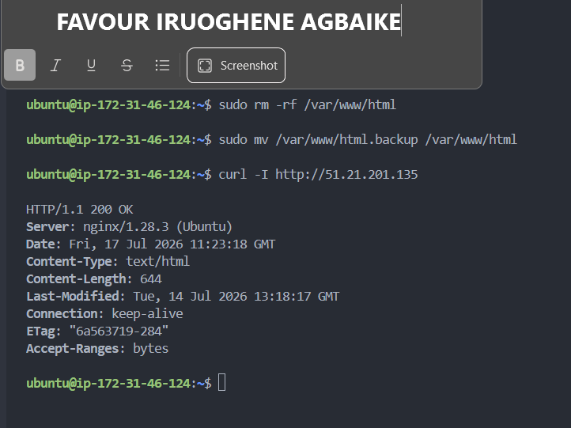

### Notes

Answer the following in your own words:

**1. What caused the application to break in this scenario?**

I moved the entire folder that held my deployed React app, /var/www/html, out of the way, and replaced it with a completely empty folder. Since nginx was still pointed at that same location, but there was nothing inside it anymore, it had no files to actually serve, which is why it returned a 403 Forbidden error instead of the app.

---

**2. How did you fix the issue and restore the application?**

Since I had backed up the original folder by renaming it to html.backup before creating the empty one, recovery was simple. I deleted the empty placeholder folder, then renamed my backup folder back to its original name, html. Once that was done, nginx immediately had access to the real files again, and the site came back online without needing to restart or reconfigure anything.

---

**3. What steps would you take to prevent this kind of issue in real production systems?**

The main thing that saved me here was having a backup before making any risky change, that's a habit I'd carry into any real production system. Beyond that, I'd want deployments to go through a proper process, like a script or pipeline that copies new files into place safely, rather than manually deleting or moving folders by hand, since manual steps are exactly where mistakes like this happen. Having monitoring in place that alerts you the moment the site starts returning errors would also help catch this kind of issue within seconds, rather than someone happening to notice the site is down.

---

# Task 8 — Security & Reliability Review

## Goal

Review and reflect on the security and reliability practices applied during this assignment.

### Security & Reliability Notes

Answer the following in your own words:

**1. Why is SSH key-based authentication more secure than sharing passwords?**

With SSH keys, there's a private key that stays only on my own computer, and a public key that lives on the server. To log in, I need the actual private key file, not just something I can remember or type. Passwords can be guessed, leaked, or reused across different accounts, but a private key is a long, random file that's practically impossible to guess, and it never has to be typed or transmitted anywhere, which makes it much harder for anyone to steal.

---

**2. Why should only required ports be open on a production server?**

Every open port is basically a door into the server, and each one is something an attacker could try to get through. If I open every port just in case, I'm creating extra doors that don't even need to exist, and each one is one more thing that could be misconfigured or exploited. Keeping only the ports actually needed, like 80 for the website and 22 for SSH, means there's simply less surface area for anything to go wrong.

---

**3. Why is it important for Nginx to be enabled on boot?**

If the server ever restarts, whether from a planned reboot, a crash, or AWS doing maintenance, having nginx enabled means it starts back up automatically without anyone needing to log in and start it manually. Without that, the site could just silently stay down after a restart until someone happens to notice.

---

**4. What are the risks of sharing secrets, keys, or credentials publicly?**

If something like a private key, password, or access credential ends up somewhere public, like a GitHub repository, anyone in the world could use it to get into the server or account it belongs to. This could mean someone deleting data, running up huge costs on a cloud account, or using the server for something malicious, all under my name. That's exactly why I've been careful throughout this course to blur sensitive details in screenshots and keep things like .pem files and credentials out of anything I commit to git.

---

**5. Why should cloud resources be stopped or terminated when they are no longer needed?**

Cloud resources like EC2 instances cost money for every hour they're running, whether or not I'm actually using them. Since my AWS account is on a free trial with limited credit, leaving something running unnecessarily just quietly drains that credit for no benefit. Stopping an instance when I'm done for the day, like I did earlier, keeps costs down while still preserving everything I've built, so I can pick back up exactly where I left off.

---

# LinkedIn Post (Required)

## Evidence

#### LinkedIn Post URL

https://www.linkedin.com/posts/favour-iruoghene-agbaike-6177ab236_devops-reactjs-ubuntu-share-7483849736383557633-p3m_/?utm_source=share&utm_medium=member_desktop&rcm=ACoAADrZq7MBSujUP7_tlhkrVgRRMpJCFD9wPGY

`Add your URL here`

---

#### Screenshot — Published LinkedIn post

---

# Submission Instructions

- Add all required screenshots in your submission
- Full name must be visible in required screenshots
- Do not expose sensitive information (keys, passwords, account IDs)

---

# Completion Checklist

- [x] Task 1: Screenshots (browser, ip a, ss -tulpen, ufw status) + Notes answered
- [x] Task 2: Screenshots (nginx status, nginx -t, ss port 80) + Notes answered
- [x] Task 3: Screenshots (access log, error log, journalctl) + Notes answered
- [x] Task 4: Screenshots (uptime, free -h, df -h, du -sh) + Notes answered
- [x] Task 5: Screenshots (ls html, grep deployed by, grep try_files) + Notes answered
- [x] Task 6: Screenshots (nginx -t fail, nginx -t pass, curl recovery) + Notes answered
- [x] Task 7: Screenshots (curl failure, curl recovery) + Notes answered
- [x] Task 8: Security & Reliability Notes answered
- [x] LinkedIn post published and URL submitted
- [x] Full Name visible in all required screenshots
- [x] No sensitive data exposed

---

## 📌 About DMI & CloudAdvisory

DevOps Micro Internship (DMI) is a project-based DevOps program run by Pravin Mishra (The CloudAdvisory) focused on real-world execution, systems thinking, and career readiness.

It helps learners build strong DevOps foundations with hands-on experience.

---

## 📌 Resources

- 🌐 DMI Official Website: https://pravinmishra.com/dmi
- 🎓 DevOps for Beginners (Udemy): https://www.udemy.com/course/devops-for-beginners-docker-k8s-cloud-cicd-4-projects/
- 🎓 Agentic AI DevOps with Claude Code: https://www.udemy.com/course/ultimate-agentic-ai-devops-with-claude-code/
- 🎓 DevOps with Claude Code: Terraform, EKS, ArgoCD & Helm: https://www.udemy.com/course/devops-with-claude-code-terraform-eks-argocd-helm/
- ▶️ YouTube Playlist: https://www.youtube.com/playlist?list=PLFeSNDtI4Cho
- 🔗 Pravin Mishra (LinkedIn): https://www.linkedin.com/in/pravin-mishra-aws-trainer/
- 🏢 CloudAdvisory (LinkedIn): https://www.linkedin.com/company/thecloudadvisory/

---

_This submission is part of DevOps Micro Internship (DMI) Cohort 3 — Agentic AI Track._
