# Assignment 5 — Bash Script Automation Drill (OPS Checklist)

Part of the DevOps Micro Internship (DMI) Cohort 3 with Agentic AI

---

## Purpose

In this assignment, you will practice Bash scripting by building a series of small automation scripts covering environment setup, variables, arrays, loops, file conditionals, if-else logic, and functions. These scripts form the foundation of real-world Linux automation used in DevOps, cloud, and production support environments.

---

# Task 1 — Bash Environment & Workspace Setup

## Goal

Verify that Bash is available on your system and create a clean workspace for this assignment.

### Evidence

#### Screenshot 1 — Output of `echo $SHELL` and `bash --version`

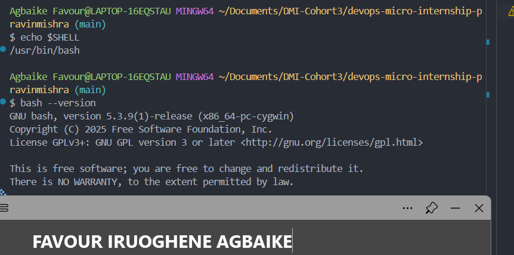

---

#### Screenshot 2 — Output of `pwd` and `ls -lah` showing the scripts directory

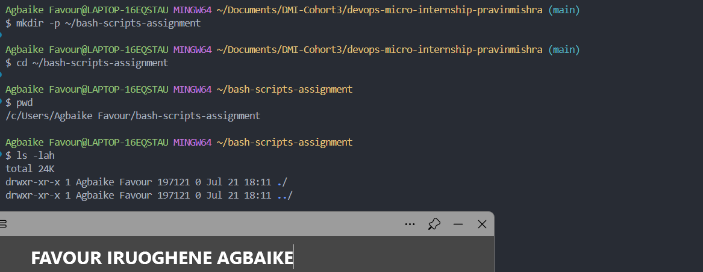

---

### Notes

Answer the following in your own words:

**1. What is Bash?**

Bash (Bourne Again Shell) is a command line interpreter and scripting language used in Linux and Unix-like systems. It reads the commands you type, interprets them, and passes them to the operating system to execute. It's also the shell you use to write scripts, sequences of commands saved in a file that run automatically.

---

**2. What is the difference between shell and Bash?**

Shell is the general term for any command line interpreter, the interface between you and the operating system's kernel. Bash is one specific type of shell, it's the most widely used one on Linux systems, but others exist too, like Zsh, Ksh, or Csh. So Bash is a shell, but not every shell is Bash.

---

**3. Why is it important to confirm the Bash version before writing scripts?**

Different Bash versions support different features. Some newer scripting syntax (like certain array operations or string manipulations) only works on more recent versions, and won't run correctly on older ones. Confirming the version upfront avoids writing a script that fails or behaves unexpectedly once it's actually deployed on a server that might be running a different version than your local machine.

---

# Task 2 — Your First Bash Script

## Goal

Create your first Bash script, make it executable, and run it from the terminal.

### Evidence

#### Screenshot 1 — Content of `first-script.sh`

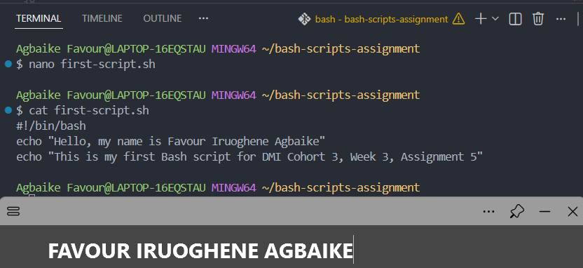

---

#### Screenshot 2 — Output of `./first-script.sh`

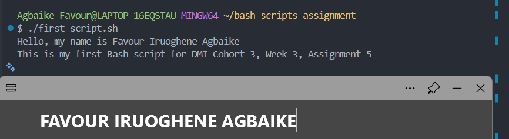

---

#### Screenshot 3 — Output of `ls -l first-script.sh` showing executable permission

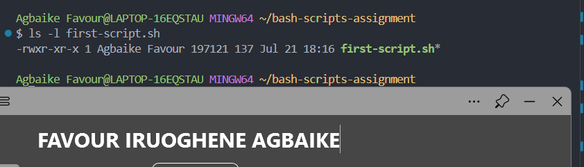

---

### Notes

Answer the following in your own words:

**1. What is the purpose of `#!/bin/bash`?**

This line is called a shebang. It tells the operating system exactly which interpreter should be used to run the rest of the script, in this case, Bash. Without it, the system wouldn't know how to correctly interpret the commands inside the file, and it might try to run it with the wrong shell or fail entirely.

---

**2. Why do we use `chmod +x` before running a script?**

By default, a newly created file doesn't have execute permission, only read and write. chmod +x adds the execute permission, which is what allows the system to actually run the file as a program rather than just treating it as plain text. Without this step, trying to run the script with ./first-script.sh would give a "permission denied" error.

---

**3. What is the difference between running a script using `./script.sh` and `bash script.sh`?**

./script.sh runs the file directly as an executable, which relies on the shebang line at the top to know which interpreter to use, and it requires the execute permission to be set first. bash script.sh explicitly tells the system to run the file using Bash, regardless of the shebang line or whether execute permission is set. So bash script.sh works even if you forgot to chmod +x it, since you're not executing the file itself, you're passing it as an argument to the Bash interpreter.

---

# Task 3 — Variables: User Information Script

## Goal

Use variables to store and display user-related information.

### Evidence

#### Screenshot 1 — Content of `user-info.sh`

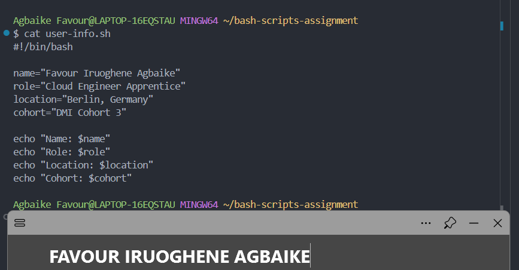

---

#### Screenshot 2 — Output of `./user-info.sh`

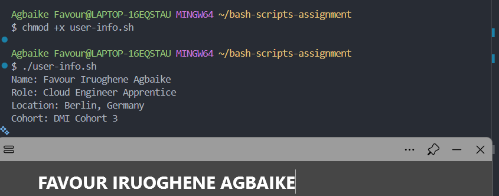

---

### Notes

Answer the following in your own words:

**1. What is a variable in Bash?**

A variable is a named container that stores a piece of information, like text or a number, so it can be reused later in the script without retyping it. In this script, name, role, location, and cohort are all variables holding specific values that get pulled into the echo statements below them.

---

**2. Why should we avoid spaces around the `=` sign when creating variables?**

In Bash, spaces around = change how the line gets interpreted. Something like name = "Favour" would actually be read as trying to run a command called name with arguments = and "Favour", rather than assigning a value to a variable. Bash requires the exact syntax name="Favour" with no spaces for the assignment to work correctly.

---

**3. How do you access the value stored inside a Bash variable?**

You access a variable's value by putting a dollar sign in front of its name, like $name. In this script, wrapping it in quotes with the dollar sign, such as "Name: $name", lets Bash substitute the variable's actual value into the string when it prints.

---

# Task 4 — Arrays & Loops: Tools Checklist Script

## Goal

Use arrays and loops to print a checklist of tools used in Bash scripting.

### Evidence

#### Screenshot 1 — Content of `tools-checklist.sh`

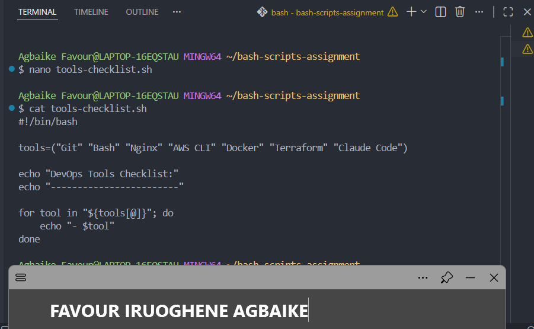

---

#### Screenshot 2 — Output of `./tools-checklist.sh`

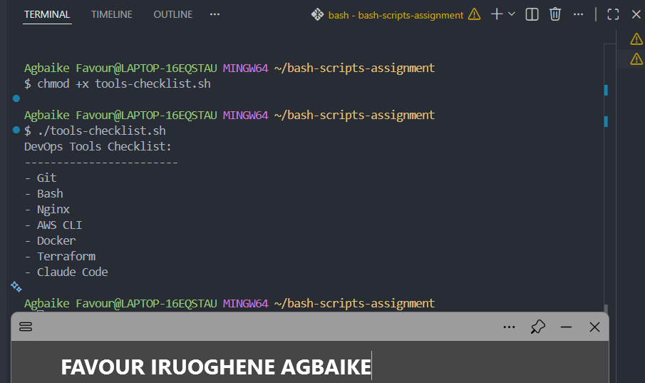

---

### Notes

Answer the following in your own words:

**1. What is an array in Bash?**

An array is a variable that can hold multiple values at once, instead of just one. In this script, tools is a single array containing seven different tool names, rather than needing seven separate variables.

---

**2. Why are arrays useful in scripts?**

Arrays let you group related data together and work with it as a collection. Instead of writing a separate echo line for every tool, you can store them all in one array and loop through it, which makes the script shorter, easier to update, and easier to scale if you need to add or remove items later.

---

**3. What does `"${tools[@]}"` mean?**

This expands to every single item in the tools array, treating each one as a separate value. The @ symbol specifically means "all elements," and wrapping it in quotes ensures that items with spaces in them, like "AWS CLI," are treated as one single item rather than being accidentally split into two.

---

**4. What is the purpose of the `for` loop in this script?**

The for loop goes through the tools array one item at a time, and for each item, it runs the echo command to print it with a dash in front. This means the script can handle any number of tools in the array without needing to write a separate line of code for each one.

---

# Task 5 — Loops: Number Counter Script

## Goal

Use loops to repeat a task multiple times.

### Evidence

#### Screenshot 1 — Content of `counter.sh`

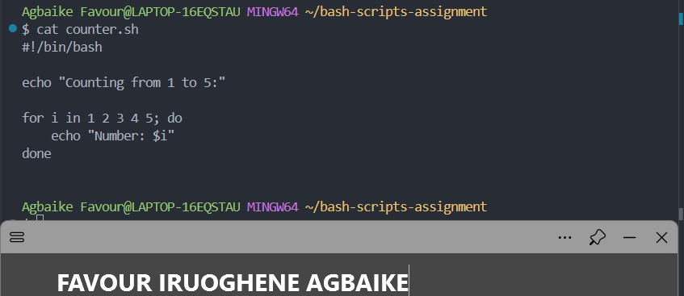

---

#### Screenshot 2 — Output of `./counter.sh`

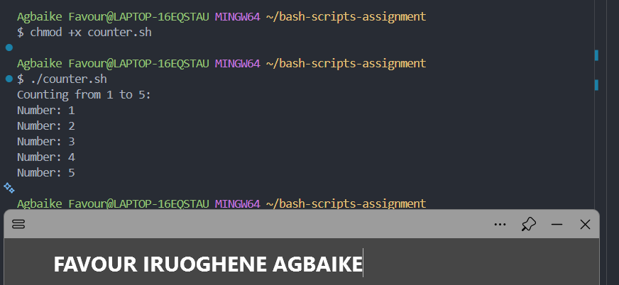

---

### Notes

Answer the following in your own words:

**1. What is a loop?**

A loop is a way to repeat a set of instructions multiple times without writing the same code over and over. In this script, the for loop repeats the echo command once for every number in the list, so the script only needs to write that instruction once.

---

**2. Why do we use loops in Bash scripting?**

Loops save time and reduce repetition. Instead of writing five separate echo lines for numbers 1 through 5, one loop handles all of them. This becomes even more valuable in real automation tasks, like checking the status of ten servers or processing a hundred files, where writing separate code for each one manually just isn't practical.

---

**3. How many times did the loop run in your script?**

The loop ran 5 times, once for each number in the list 1 2 3 4 5.

---

**4. What would you change if you wanted the loop to run 10 times?**

I would either extend the list to include all numbers up to 10, like for i in 1 2 3 4 5 6 7 8 9 10; do, or use a range instead, like for i in {1..10}; do, which is a shorter way of writing the same sequence.

---

# Task 6 — Files & Conditionals: File Validation Script

## Goal

Use file checks and conditionals to verify whether files and directories exist.

### Evidence

#### Screenshot 1 — Output of `ls -lah ../test-folder`

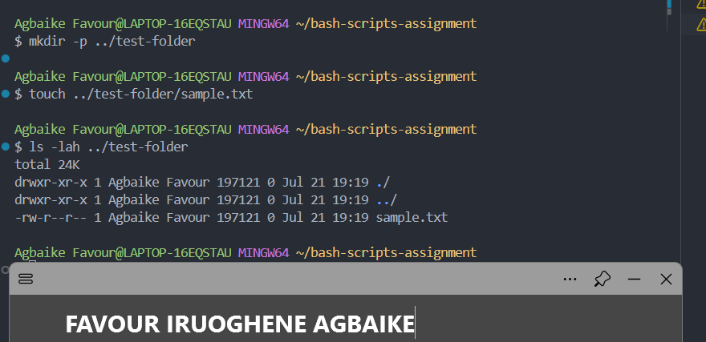

---

#### Screenshot 2 — Content of `file-check.sh`

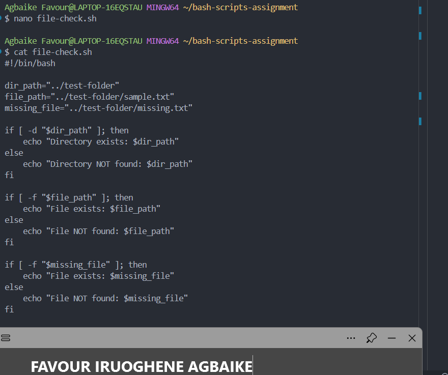

---

#### Screenshot 3 — Output of `./file-check.sh`

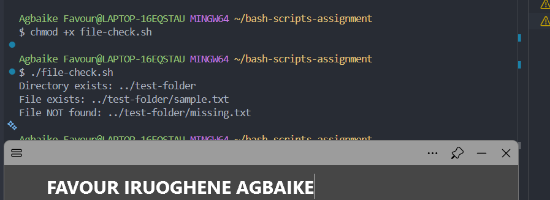

---

### Notes

Answer the following in your own words:

**1. What does `-d` check in Bash?**

-d checks whether a given path exists and is specifically a directory (a folder). If the path exists but is a file instead of a directory, -d will return false.

---

**2. What does `-f` check in Bash?**

-f checks whether a given path exists and is specifically a regular file, not a directory. This is what confirmed sample.txt exists, and correctly flagged missing.txt as not found since it was never created.

---

**3. Why should file and directory paths be stored in variables?**

Storing paths in variables like dir_path and file_path means you only need to update the path in one place if it ever changes, rather than hunting through the whole script to update it everywhere it's used. It also makes the script easier to read, since the variable names describe what the path represents.

---

**4. What happens if the file does not exist?**

The condition inside the if [ -f "$missing_file" ] check evaluates to false, so the script runs the code inside the else block instead, printing "File NOT found" rather than crashing or throwing an error. This is exactly what happened with missing.txt in the output above.

---

# Task 7 — Conditionals: Pass or Retry Script

## Goal

Use if-else conditionals to make decisions based on a variable value.

### Evidence

#### Screenshot 1 — Content of `score-check.sh` with `score=85`

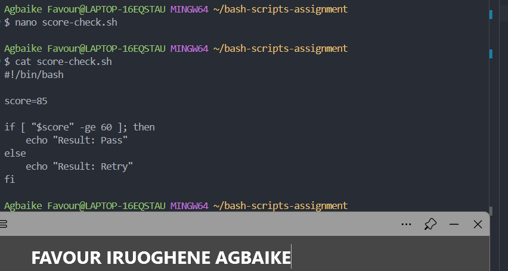

---

#### Screenshot 2 — Output showing `Result: Pass`

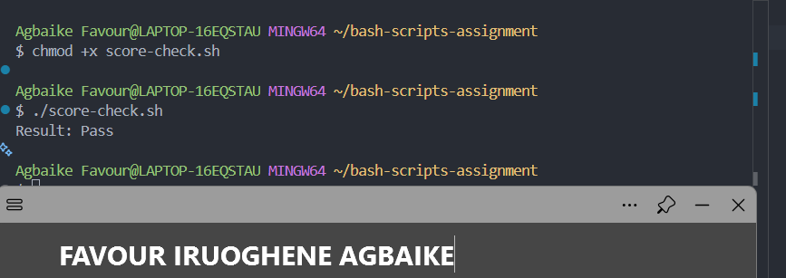

---

#### Screenshot 3 — Content of `score-check.sh` with `score=55`

## 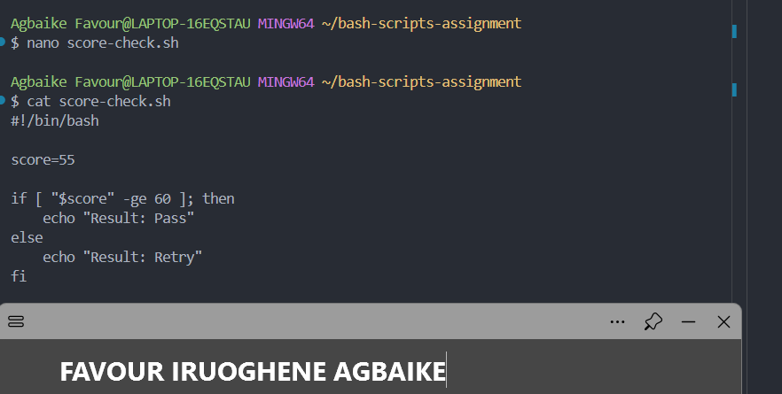

#### Screenshot 4 — Output showing `Result: Retry`

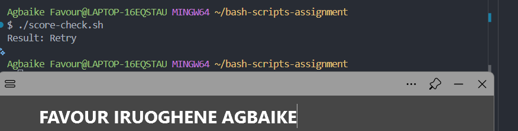

---

### Notes

Answer the following in your own words:

**1. What is the purpose of if-else in Bash?**

If-else lets a script make a decision and take a different action depending on whether a condition is true or false. In this script, it checks whether the score meets the passing threshold and prints a different result depending on the outcome, rather than always printing the same thing regardless of the value.

---

**2. What does `-ge` mean?**

-ge stands for "greater than or equal to." It's used to compare two numbers, so [ "$score" -ge 60 ] checks whether the value stored in score is 60 or higher.

---

**3. Why should conditions be tested with different values?**

Testing with different values, like 85 and 55, confirms the script actually behaves correctly on both sides of the condition, not just the side you expect. If I had only tested with 85, I wouldn't know for certain whether the "Retry" branch of the logic even works, since it was never actually triggered.

---

**4. How can conditionals help in automation scripts?**

Conditionals let automation scripts respond intelligently to different situations instead of blindly running the same steps every time. For example, a script checking disk space could conditionally send an alert only if usage crosses a certain threshold, rather than sending a notification every single time it runs regardless of the actual disk usage.

---

# Task 8 — Functions: Final Bash Automation Script

## Goal

Create a final Bash script using functions to organize reusable code.

### Evidence

#### Screenshot 1 — Content of `final-automation.sh`

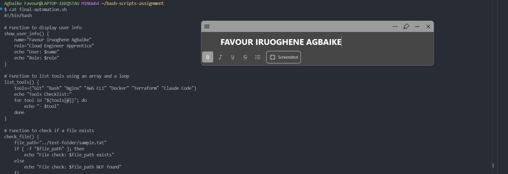

---

#### Screenshot 2 — Output of `./final-automation.sh`

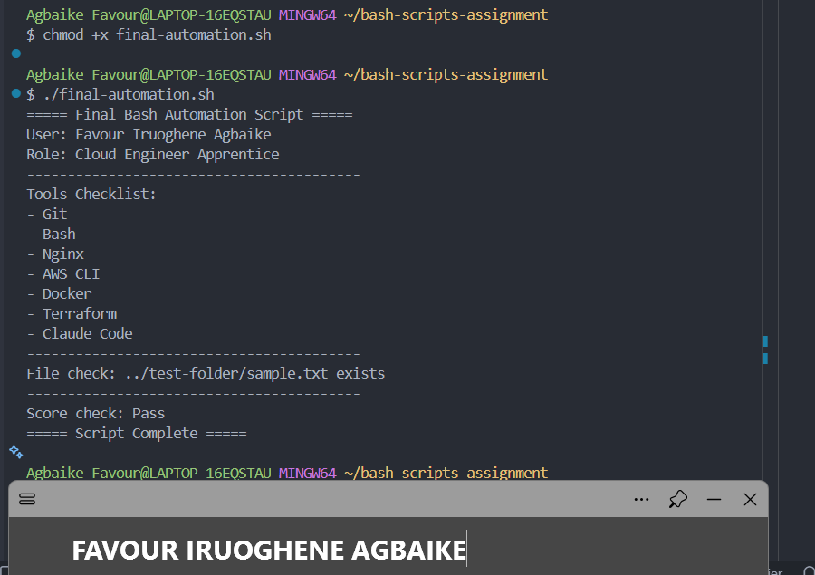

---

#### Screenshot 3 — Output of `ls -lah` showing all created scripts

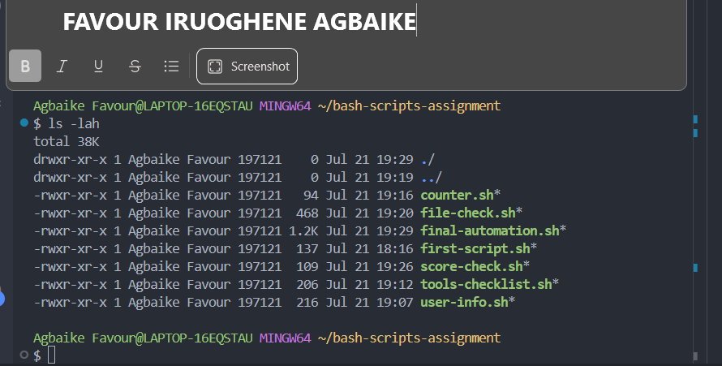

---

### Notes

Answer the following in your own words:

**1. What is a function in Bash?**

A function is a named block of code that groups a set of commands together so they can be reused whenever needed, just by calling the function's name. In this script, show_user_info, list_tools, check_file, and check_score are each self-contained blocks that run their own specific task.

---

**2. Why are functions useful in scripts?**

Functions make scripts more organized and easier to read, since related logic is grouped together under a clear name instead of being scattered throughout the file. They also make code reusable, if I needed to check the score again somewhere else in a longer script, I could just call check_score again rather than rewriting the same conditional logic.

---

**3. Which functions did you create in this script?**

I created four functions: show_user_info to display my name and role, list_tools to loop through and print the tools checklist, check_file to verify whether a specific file exists, and check_score to evaluate whether a score passes a threshold.

---

**4. How does this final script combine variables, arrays, loops, conditionals, files, and functions?**

Each function pulls together one or more of the concepts from earlier tasks. show_user_info uses variables to store and print my details. list_tools uses an array combined with a for loop to print every tool. check_file uses an if conditional with the -f file test to confirm whether a file exists. check_score uses an if-else conditional with a numeric comparison. Bringing all four functions together and calling them in sequence at the bottom of the script shows how these separate building blocks combine into one complete, organized automation script.

---

# LinkedIn Post (Required)

## Evidence

#### LinkedIn Post URL

Paste your LinkedIn post URL here:

`https://www.linkedin.com/posts/favour-iruoghene-agbaike-6177ab236_dmibypravinmishra-devops-bashscripting-share-7485388477908500480-AuWF/?utm_source=share&utm_medium=member_desktop&rcm=ACoAADrZq7MBSujUP7_tlhkrVgRRMpJCFD9wPGY`

---

#### Screenshot — Published LinkedIn post

---

# Submission Instructions

- Add all required screenshots in your submission
- Full name must be visible in required screenshots
- All script files must be created and run successfully
- Required notes must be answered clearly for every task
- Do not expose sensitive information (keys, passwords, credentials)

---

# Completion Checklist

- [x] Task 1: Environment setup verified, workspace created (Screenshots 1–2, Notes answered)
- [x] Task 2: First script created, executed, permissions verified (Screenshots 1–3, Notes answered)
- [x] Task 3: Variables script created and run (Screenshots 1–2, Notes answered)
- [x] Task 4: Arrays and loops script created and run (Screenshots 1–2, Notes answered)
- [x] Task 5: Counter loop script created and run (Screenshots 1–2, Notes answered)
- [x] Task 6: File validation script created and run (Screenshots 1–3, Notes answered)
- [x] Task 7: Pass/Retry conditional script tested with both values (Screenshots 1–4, Notes answered)
- [x] Task 8: Final automation script created and run (Screenshots 1–3, Notes answered)
- [x] All scripts run without errors
- [x] Full Name visible in all required screenshots
- [x] LinkedIn post published and URL submitted
- [x] No sensitive data exposed

---

## 📌 About DMI & CloudAdvisory

DevOps Micro Internship (DMI) is a project-based DevOps program run by Pravin Mishra (The CloudAdvisory) focused on real-world execution, systems thinking, and career readiness.

It helps learners build strong DevOps foundations with hands-on experience.

---

## 📌 Resources

- 🌐 DMI Official Website: https://pravinmishra.com/dmi
- 🎓 DevOps for Beginners (Udemy): https://www.udemy.com/course/devops-for-beginners-docker-k8s-cloud-cicd-4-projects/
- 🎓 Agentic AI DevOps with Claude Code: https://www.udemy.com/course/ultimate-agentic-ai-devops-with-claude-code/
- 🎓 DevOps with Claude Code: Terraform, EKS, ArgoCD & Helm: https://www.udemy.com/course/devops-with-claude-code-terraform-eks-argocd-helm/
- ▶️ YouTube Playlist: https://www.youtube.com/playlist?list=PLFeSNDtI4Cho
- 🔗 Pravin Mishra (LinkedIn): https://www.linkedin.com/in/pravin-mishra-aws-trainer/
- 🏢 CloudAdvisory (LinkedIn): https://www.linkedin.com/company/thecloudadvisory/

---

_This submission is part of DevOps Micro Internship (DMI) Cohort 3 — Agentic AI Track._
