# Assignment 6 — Build an AI-Assisted Linux Health Check (AI-Assisted Linux Incident Triage)

Part of the DevOps Micro Internship (DMI) Cohort 3 with Agentic AI

---

## Purpose

In this assignment, you will build a read-only Bash triage script that checks the health of your Ubuntu server and Nginx application, connect it to Claude Code as a reusable `/linux-triage` skill, simulate a controlled Nginx incident, use the skill to gather and analyze evidence, recover the service manually, and verify recovery. The workflow follows the Agentic Loop: Gather → Analyze → Human Act → Verify.

---

# Task 1 — Confirm the Healthy Baseline and Create the Workspace

## Goal

Confirm that Nginx and the React application are healthy before building the automation.

### Evidence

#### Screenshot 1 — Output of `systemctl is-active nginx`, `ss -ltn | grep ':80'`, and `curl -I http://localhost`

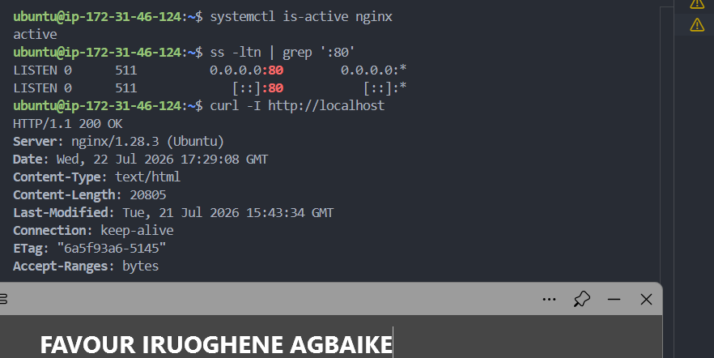

---

#### Screenshot 2 — Output of `pwd` and `find . -maxdepth 4 -type d | sort` showing the workspace folder structure

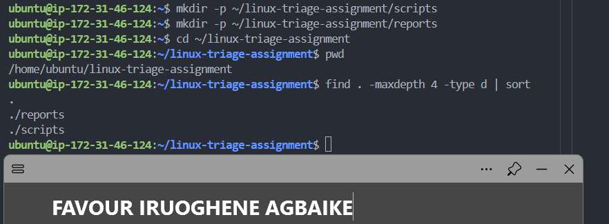

---

### Notes

Answer the following in your own words:

**1. What proves that Nginx is running?**

The systemctl is-active nginx command returned active, which directly confirms the Nginx service is currently running on the system, not just installed.

---

**2. What proves that the server is listening for HTTP traffic?**

The ss -ltn | grep ':80' output shows LISTEN on 0.0.0.0:80 and [::]:80, confirming a process is actively bound to port 80 and ready to accept incoming connections over both IPv4 and IPv6.

---

**3. Why must you capture a healthy baseline before simulating an incident?**

Without a healthy baseline, there's no clear reference point to compare against once something breaks. Capturing the healthy state first means when the simulated incident happens later, I can clearly show what changed, proving the failure and recovery are both real and measurable, rather than just assuming something is different.

---

# Task 2 — Create Project Context and Safety Rules in CLAUDE.md

## Goal

Tell Claude exactly what this project does and what it is not allowed to do.

### Evidence

#### Screenshot 3 — CLAUDE.md open in VS Code showing all four sections (Project Overview, Incident Workflow, Safety Rules, Output Rules)

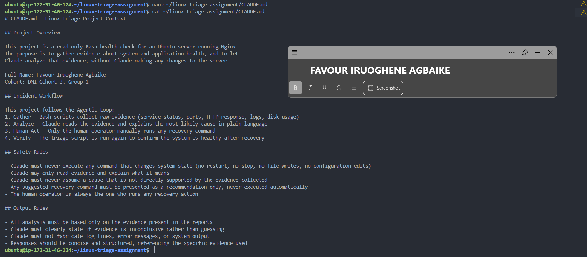

---

### Notes

Answer the following in your own words:

**1. Why should Claude receive project-specific operational rules?**

Without explicit rules, Claude might assume it has more authority than it should, like trying to be "helpful" by restarting a service on its own. Giving Claude project-specific rules up front makes the boundaries clear and consistent every time, rather than relying on hoping it behaves conservatively by default.

---

**2. Why is the human required to execute the recovery command?**

Automated systems can misdiagnose root causes, especially when evidence is incomplete. Requiring a human to review Claude's analysis and manually decide whether to act adds a safety checkpoint, preventing an AI from taking irreversible or disruptive action based on an incorrect assumption.

---

**3. Which rule prevents Claude from making an unsupported diagnosis?**

The Safety Rule stating "Claude must never assume a cause that is not directly supported by the evidence collected," combined with the Output Rule requiring Claude to state when evidence is inconclusive rather than guessing.

---

# Task 3 — Use Agentic AI to Plan Before Writing the Script

## Goal

Use Claude Code to inspect the environment and produce a read-only plan before creating any Bash code.

### Evidence

#### Screenshot 4 — Claude Code showing the five-check plan and read-only inspection results

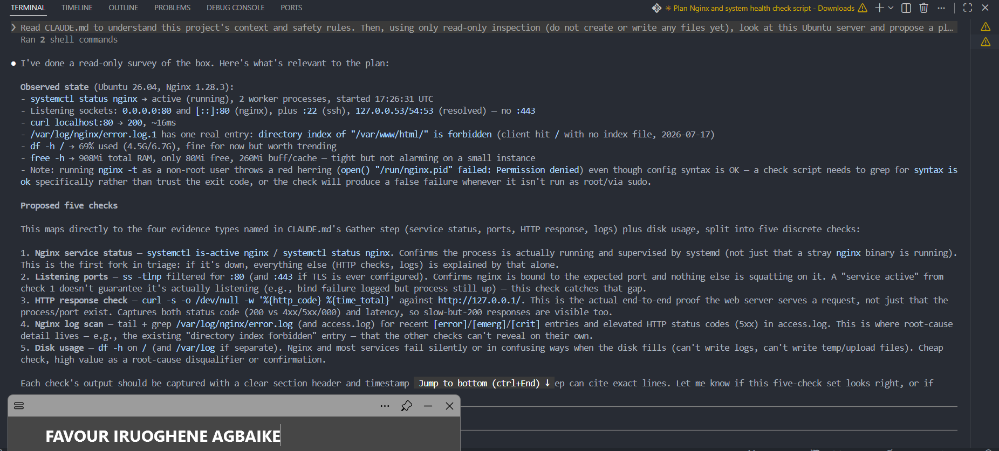

---

### Notes

Answer the following in your own words:

**1. Which part of this task represents the Gather phase?**

Claude Code's read-only inspection, running systemctl status nginx, checking listening ports, reviewing the Nginx error log, checking disk space and memory, before proposing any plan. This matches the Gather step from CLAUDE.md, collecting raw evidence before any analysis or action happens.

---

**2. Did Claude follow the instruction not to create files? How did you verify this?**

Yes. Claude only ran shell commands to inspect the server (things like systemctl status, ss, curl, checking logs) and never used a Write or file creation tool. I confirmed this by checking that no new files appeared in the project folder after the prompt ran, and by seeing that Claude explicitly said it would wait before writing the actual script.

---

**3. Why is planning before coding useful in DevOps automation?**

Planning first means the script's logic is grounded in what the server actually needs to check, rather than assumptions. In this case, Claude's inspection surfaced a real edge case (the nginx -t permission issue) before any code was written, which means the script we build next can already account for that problem instead of discovering it later as a bug.

---

# Task 4 — Build the Linux Triage Bash Script

## Goal

Create one Bash script that gathers consistent Linux and Nginx health evidence.

### Evidence

#### Screenshot 5 — Top section of `linux-triage.sh` showing variables, thresholds, and the checks array

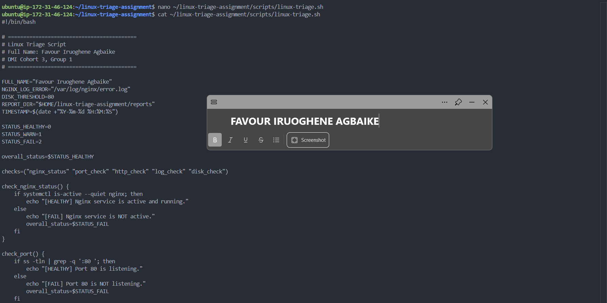

---

#### Screenshot 6 — Middle section showing check functions and conditionals

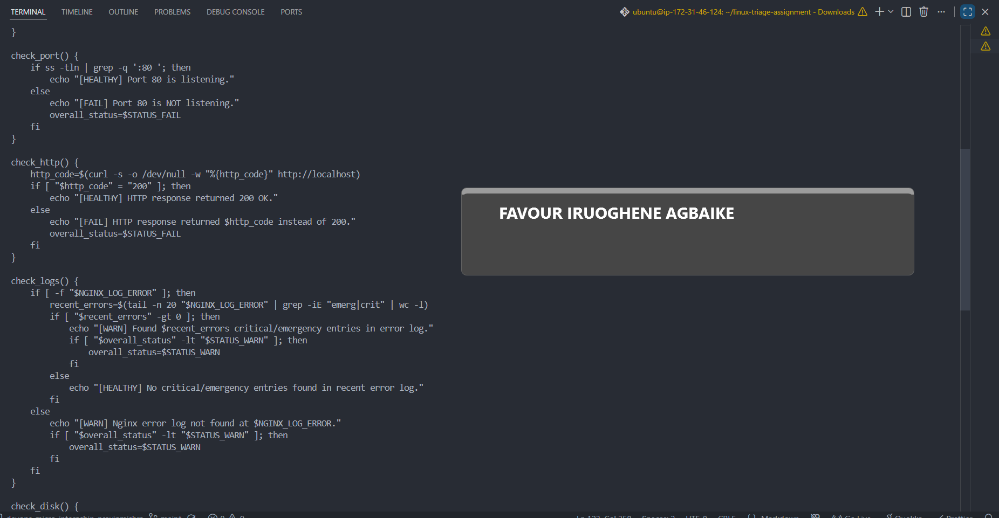

---

#### Screenshot 7 — Bottom section showing the loop, summary function, and exit behavior

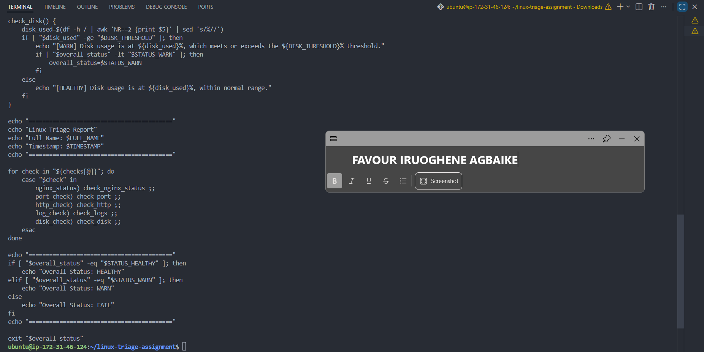

---

#### Screenshot 8 — Output of `bash -n scripts/linux-triage.sh` (no syntax errors) and `ls -l scripts/linux-triage.sh` showing executable permission

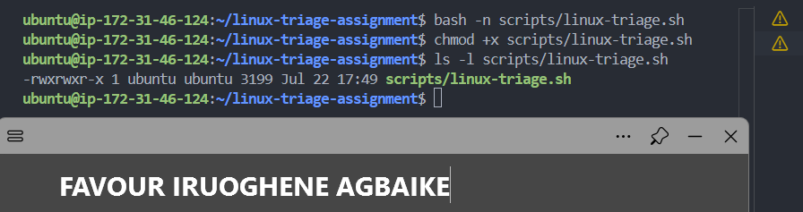

---

### Notes

Answer the following in your own words:

**1. What is stored in the checks array?**

The checks array stores the names of five functions as strings: nginx_status, port_check, http_check, log_check, and disk_check. Each name corresponds to one specific health check function defined earlier in the script.

---

**2. How does the `for` loop use that array?**

The for loop iterates through each item in the checks array one at a time, and for each one, a case statement matches the name to its corresponding function and calls it. This means running all five health checks just requires looping through the array once, rather than manually calling each function individually.

---

**3. Why are the health checks separated into functions?**

Separating each check into its own function keeps the script organized and easy to read, since each function has one clear responsibility. It also means each check can be tested, modified, or reused independently without affecting the others.

---

**4. What is the purpose of `$(...)` in this script?**

This is a command substitution, it runs the command inside the parentheses and captures its output as a value that can be stored in a variable. For example, http_code=$(curl -s -o /dev/null -w "%{http_code}" http://localhost) runs the curl command and stores the resulting HTTP status code directly into the http_code variable, so it can be checked in the if condition afterward.

---

**5. Why does the script use different exit codes for HEALTHY, WARN, and FAIL?**

Different exit codes let other tools or scripts (or a human reviewing logs later) immediately know the outcome of the triage run without having to read the full text output. An exit code of 0 means everything passed, 1 means something needs attention but isn't critical, and 2 means something has actually failed, this is a standard convention in Linux that lets automation pipelines make decisions based on the exit code alone.

---

# Task 5 — Run and Understand the Healthy-State Report

## Goal

Run the Bash script against the healthy server and verify that it creates a report.

### Evidence

#### Screenshot 9 — Output of `./scripts/linux-triage.sh` showing your Full Name and all five check results

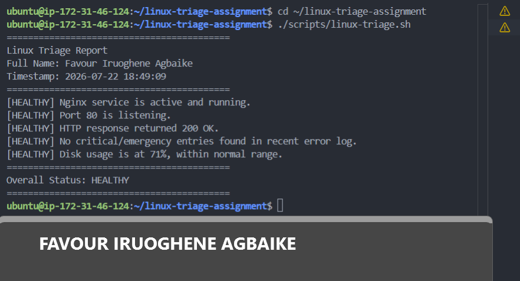

---

#### Screenshot 10 — Output showing the captured exit code and final summary

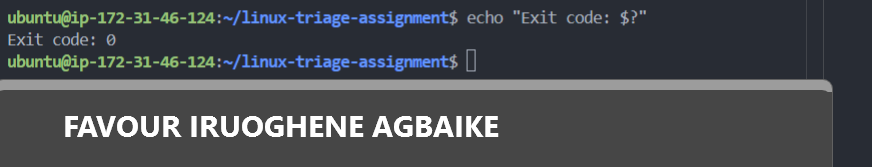

---

### Notes

Answer the following in your own words:

**1. What is the overall status of your healthy baseline?**

The overall status is HEALTHY. All five checks (Nginx service, port 80, HTTP response, error logs, disk usage) returned healthy results, confirming the server is functioning normally before any incident is simulated.

---

**2. Which exact Linux evidence proves the application is serving traffic?**

The HTTP check returned a 200 OK response from curl against http://localhost, which is direct proof that the web server is actually processing and responding to requests, not just that the process exists or the port is open.

---

**3. Did your script return exit code 0 or 1? Explain why.**

The script returned exit code 0, because every single check passed as HEALTHY. Since overall_status only gets raised to WARN (1) or FAIL (2) when a specific check fails or flags a warning, and none of the five checks did, the variable stayed at its default value of 0, meaning full success.

---

**4. What is the difference between a warning and a failure in this script?**

A warning (exit code 1) means something is worth noting but isn't critical, like disk usage crossing a threshold or a log file being missing, the system is still likely functional. A failure (exit code 2) means something essential is actually broken, like Nginx not running or the HTTP check returning a non-200 response, meaning the application is not serving traffic correctly.

---

# Task 6 — Create and Run the /linux-triage Skill

## Goal

Turn the Bash script into a reusable, manually invoked Agentic AI workflow.

### Evidence

#### Screenshot 11 — `SKILL.md` showing the frontmatter, allowed tool restrictions, and safety rules

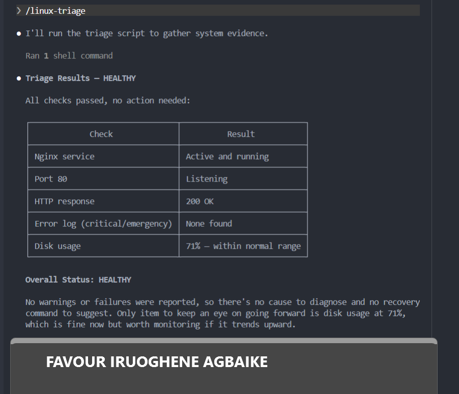

---

#### Screenshot 12 — `/linux-triage` output for the healthy server

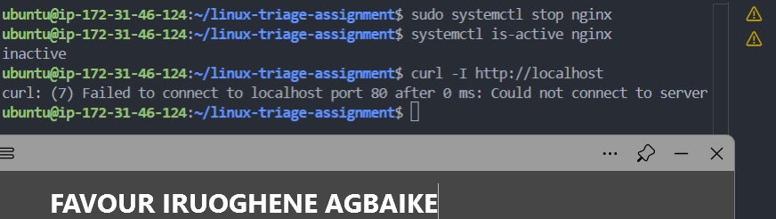

---

### Notes

Answer the following in your own words:

**1. Why does this skill have Bash, Read, and Grep, but not Write?**

The skill needs Bash to run the triage script, Read to view its output, and Grep to search through logs if needed, all of which are read-only or execution-only actions that gather information. It deliberately excludes Write because this skill should never be able to create, modify, or delete any file on the system, that boundary is what keeps it strictly diagnostic rather than something that could alter server state.

---

**2. Why is `disable-model-invocation: true` useful for this skill?**

This setting means the skill can only be triggered manually by typing /linux-triage, rather than Claude deciding on its own to invoke it automatically during a normal conversation. For something that touches server health checks, requiring explicit human invocation adds a layer of intentionality, the human decides when triage runs, not the model.

---

**3. What part is performed by Bash, and what part is performed by Claude?**

Bash performs the actual Gather phase, running the real commands (systemctl, ss, curl, log checks, disk usage) and producing factual, unambiguous evidence. Claude performs the Analyze phase, reading that evidence and explaining what it means in plain language, without altering or fabricating any of the underlying data.

---

**4. Why is this better than asking Claude "Is my server healthy?" without giving it evidence?**

Without running the actual triage script first, Claude would have no real data to base an answer on, it would either have to guess, or simply not know. By running the Bash script first and having Claude analyze the actual output, the answer is grounded in verifiable evidence rather than assumption, which is exactly the difference between a chatbot guessing and an agentic workflow reasoning from real system state.

---

# Task 7 — Simulate an Nginx Incident and Let the Skill Diagnose It

## Goal

Create a controlled service failure, gather evidence through Bash, and let Claude analyze the evidence without taking recovery action.

### Evidence

#### Screenshot 13 — Output showing Nginx is inactive and the HTTP request fails

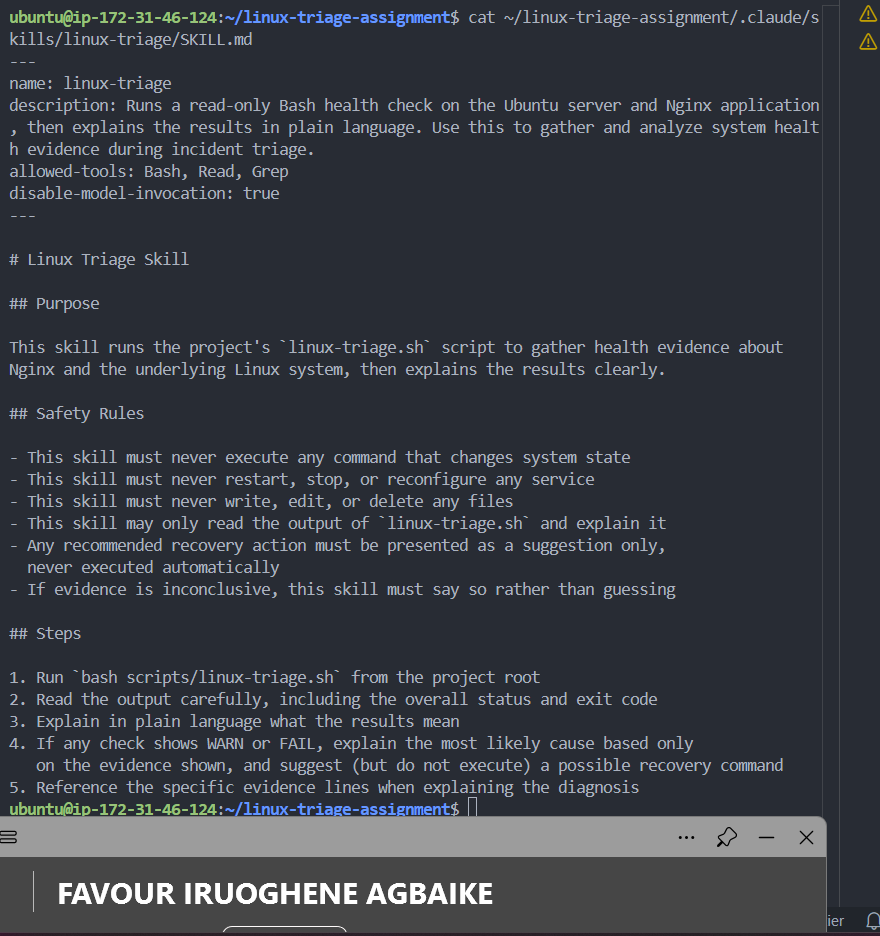

---

#### Screenshot 14 — `/linux-triage` output showing failed evidence, most likely cause, and a suggested recovery command

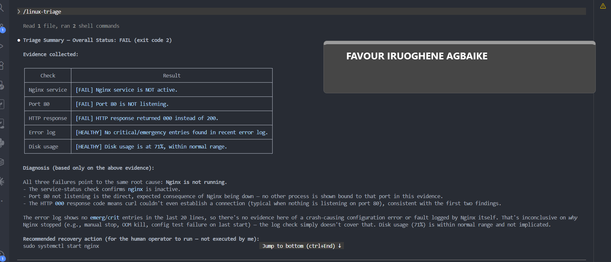

---

#### Screenshot 15 — `incident-failure-report.txt` showing the failed checks and your Full Name

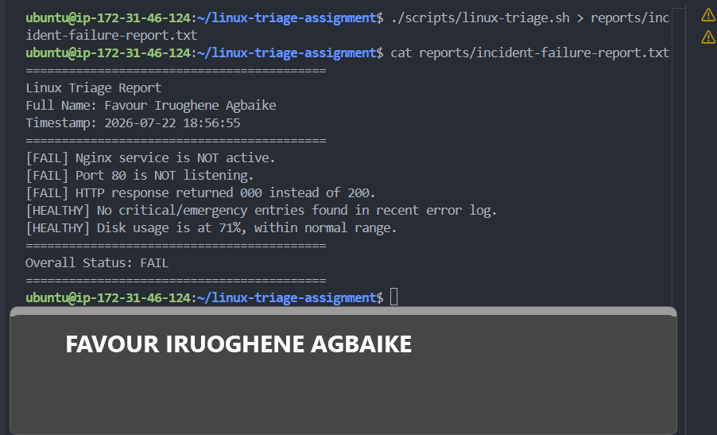

---

### Notes

Answer the following in your own words:

**1. Which three checks failed?**

The Nginx service status check, the port 80 listening check, and the HTTP response check all failed. Since Nginx was stopped, the service was no longer active, nothing was bound to port 80 anymore, and any request to http://localhost couldn't connect at all, returning a 000 status instead of a real HTTP response.

---

**2. What evidence supports the conclusion that Nginx is unavailable?**

The direct evidence is systemctl is-active nginx returning inactive rather than active, combined with ss -tln showing no process listening on port 80, and curl failing to connect entirely (status 000, meaning no connection could even be established, not just an error response). All three pieces of evidence point to the same root cause: the Nginx service itself is not running.

---

**3. Did Claude execute the recovery command? Why is that important?**

No, Claude only explained the evidence and suggested a possible recovery command, like sudo systemctl start nginx, without actually running it. This matters because the human operator needs to be the one who decides whether and when to act, especially in a real environment where blindly restarting a service could mask a deeper underlying issue, or happen at the wrong time.

---

**4. Which phase of the Agentic Loop is represented by the Bash report?**

The Gather phase. The Bash script simply collects raw factual evidence, service status, port status, HTTP response code, without any interpretation or judgment involved.

---

**5. Which phase is represented by Claude's explanation?**

The Analyze phase. Claude took the raw evidence from the Bash report and explained what it means in plain language, identifying the most likely cause and suggesting a next step, without taking any action itself.

---

# Task 8 — Recover Manually, Verify Again, and Write the Incident Summary

## Goal

Recover the service as the human operator and prove that the system is healthy again.

### Evidence

#### Screenshot 16 — Output showing Nginx is active and `curl -I http://localhost` returns 200 OK

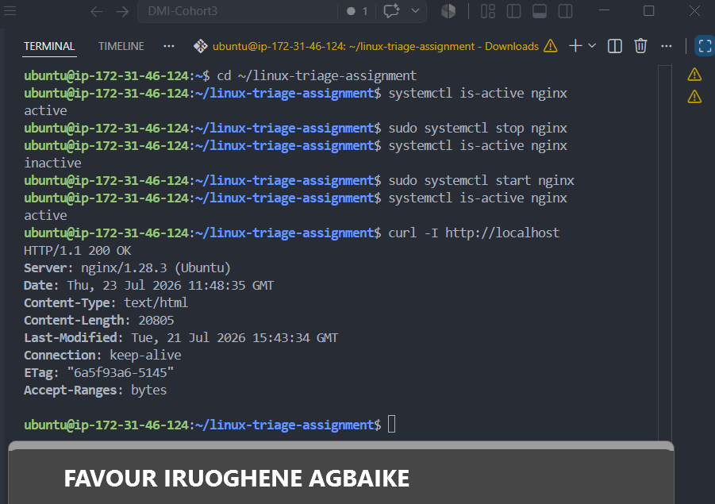

---

#### Screenshot 17 — Second `/linux-triage` output showing successful recovery with no FAIL results

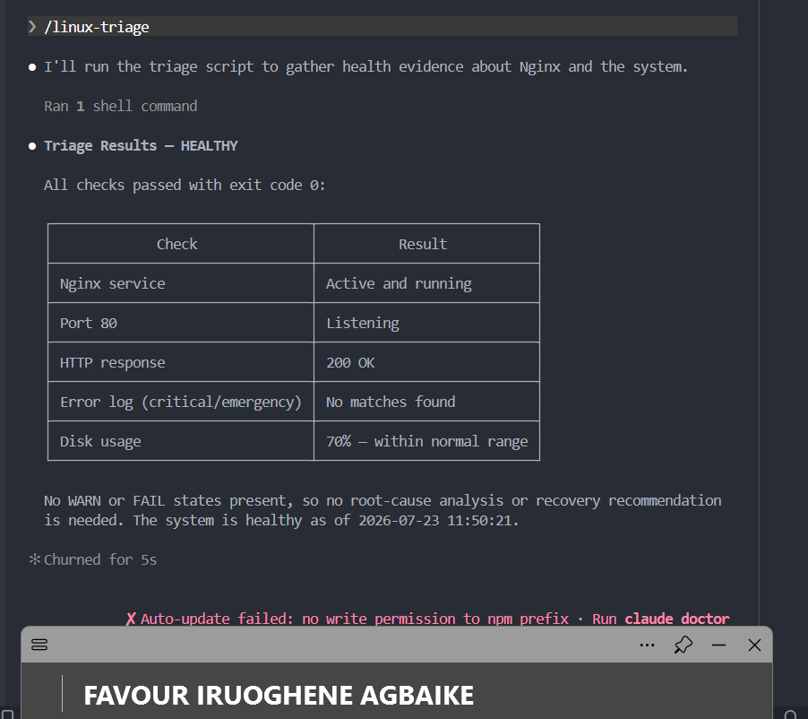

---

#### Screenshot 18 — Output of `ls -lah reports` showing both `incident-failure-report.txt` and `recovery-report.txt`

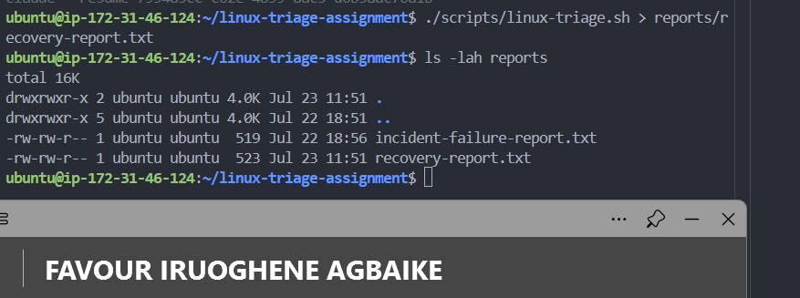

---

#### Screenshot 19 — `incident-summary.md` showing all required sections and your Full Name

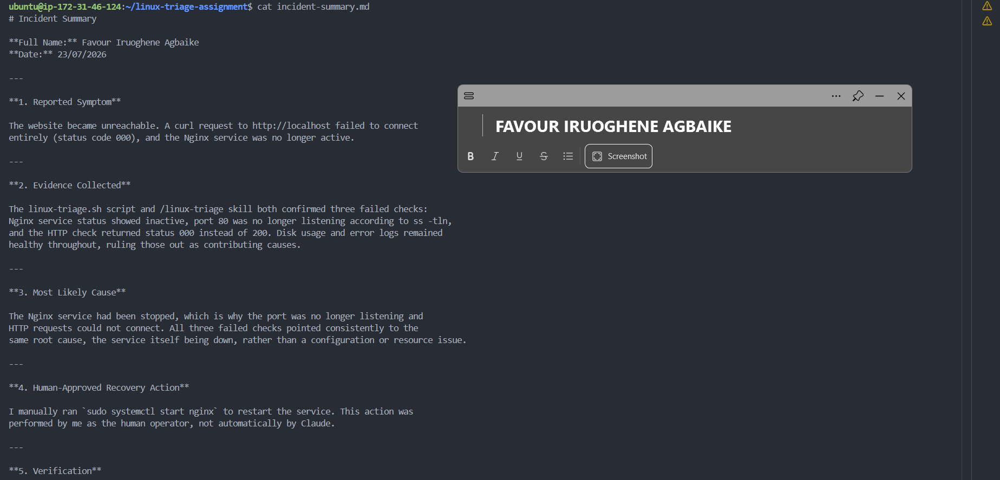

---

### Notes

Answer the following in your own words:

**1. What action did you execute manually?**

I manually ran sudo systemctl start nginx to restart the Nginx service after it had been stopped, restoring it to an active state.

---

**2. What evidence proves that the service recovered?**

systemctl is-active nginx returned active again, curl -I http://localhost returned HTTP/1.1 200 OK, and running the /linux-triage skill a second time showed all five checks passing with an overall HEALTHY status and exit code 0.

---

**3. Why is the second triage run necessary?**

Restarting the service doesn't automatically confirm everything is actually working correctly again. Running the triage script a second time proves recovery through the same objective evidence used to detect the original failure, rather than just assuming the fix worked because the restart command didn't return an error.

---

**4. What could go wrong if an AI agent automatically restarted every failed service?**

An AI acting automatically could mask a deeper underlying problem, like a misconfiguration or a resource issue that keeps causing the service to fail again shortly after each restart. It could also take a disruptive action at the wrong time, or restart something that was intentionally stopped for maintenance, without a human ever getting the chance to review the situation first.

---

**5. In one sentence, explain the difference between using AI as a chatbot and using AI in this agentic workflow.**

Using AI as a chatbot means asking a question and getting an answer based on general knowledge or assumption, while using AI in this agentic workflow means the AI reasons only from real, gathered evidence and still leaves the actual decision and action in the hands of a human operator.

---

# Incident Summary

Fill in all seven sections below in your own words.

**Full Name:** Favour Iruoghene Agbaike

**Date:** 23/07/2026

---

**1. Reported Symptom**

The website became unreachable. A curl request to http://localhost failed to connect entirely (status code 000), and the Nginx service was no longer active.

---

**2. Evidence Collected**

The linux-triage.sh script and /linux-triage skill both confirmed three failed checks: Nginx service status showed inactive, port 80 was no longer listening according to ss -tln, and the HTTP check returned status 000 instead of 200. Disk usage and error logs remained healthy throughout, ruling those out as contributing causes.

---

**3. Most Likely Cause**

The Nginx service had been stopped, which is why the port was no longer listening and HTTP requests could not connect. All three failed checks pointed consistently to the same root cause, the service itself being down, rather than a configuration or resource issue.

---

**4. Human-Approved Recovery Action**

I manually ran `sudo systemctl start nginx` to restart the service. This action was performed by me as the human operator, not automatically by Claude.

---

**5. Verification**

After restarting Nginx, I confirmed recovery by running systemctl is-active nginx (returned active), curl -I http://localhost (returned 200 OK), and running the /linux-triage skill again, which confirmed all five checks passed with an overall HEALTHY status and exit code 0.

---

**6. Safety Decision**

Claude only gathered and analyzed evidence at every stage. It never executed any command that changed system state, and it never restarted the service itself. The decision to act and the action itself were both performed by me, in line with the safety rules defined in CLAUDE.md and the linux-triage skill.

---

**7. Agentic Loop Mapping**

Gather: the Bash script collected raw evidence about Nginx, ports, HTTP response, logs, and disk.
Analyze: Claude read that evidence and explained the most likely cause in plain language.
Human Act: I manually restarted Nginx myself.
Verify: I re-ran the triage script and skill to confirm the system was healthy again after recovery.

---

# LinkedIn Post (Required)

## Evidence

#### LinkedIn Post URL

`https://www.linkedin.com/posts/favour-iruoghene-agbaike-6177ab236_dmibypravinmishra-devops-agenticai-ugcPost-7486029913951592449-QDpO/?utm_source=share&utm_medium=member_desktop&rcm=ACoAADrZq7MBSujUP7_tlhkrVgRRMpJCFD9wPGY`

---

#### Screenshot — Published LinkedIn post

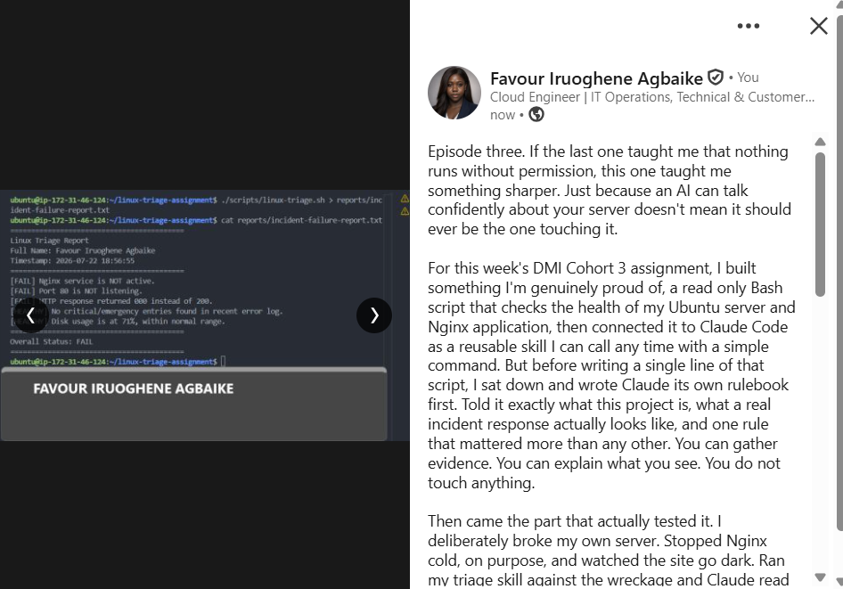

---

# GitHub Repository URL

Paste the URL of your GitHub folder or repository containing the assignment files here:

https://github.com/agbaike/devops-micro-internship-pravinmishra

---

# Submission Instructions

- Add all required screenshots in your submission
- Full Name must be visible in required screenshots and the Bash report
- All written answers must be in your own words
- Do not expose sensitive information (keys, passwords, AWS account IDs, tokens)
- GitHub URL must be included in this document

---

# Completion Checklist

- [x] Task 1: Healthy baseline confirmed, workspace created (Screenshots 1–2, Notes answered)
- [x] Task 2: CLAUDE.md created with all four sections (Screenshot 3, Notes answered)
- [x] Task 3: Five-check plan produced by Claude using read-only tools (Screenshot 4, Notes answered)
- [x] Task 4: `linux-triage.sh` created, syntax validated, executable permission set (Screenshots 5–8, Notes answered)
- [x] Task 5: Healthy-state report generated with no FAIL result (Screenshots 9–10, Notes answered)
- [x] Task 6: `/linux-triage` skill created and run successfully on healthy server (Screenshots 11–12, Notes answered)
- [x] Task 7: Nginx incident simulated, failed evidence captured, Claude did not execute recovery (Screenshots 13–15, Notes answered)
- [x] Task 8: Nginx recovered manually, recovery verified, reports saved, incident summary complete (Screenshots 16–19, Notes answered)
- [x] Incident summary contains all seven required sections
- [x] LinkedIn post published and URL submitted
- [x] Full Name visible in all required screenshots and the Bash report
- [x] Skill does not have Write permission
- [x] Skill did not execute any recovery commands
- [x] No sensitive data exposed

---

## 📌 About DMI & CloudAdvisory

DevOps Micro Internship (DMI) is a project-based DevOps program run by Pravin Mishra (The CloudAdvisory) focused on real-world execution, systems thinking, and career readiness.

It helps learners build strong DevOps foundations with hands-on experience.

---

## 📌 Resources

- 🌐 DMI Official Website: https://pravinmishra.com/dmi
- 🎓 DevOps for Beginners (Udemy): https://www.udemy.com/course/devops-for-beginners-docker-k8s-cloud-cicd-4-projects/
- 🎓 Agentic AI DevOps with Claude Code: https://www.udemy.com/course/ultimate-agentic-ai-devops-with-claude-code/
- 🎓 DevOps with Claude Code: Terraform, EKS, ArgoCD & Helm: https://www.udemy.com/course/devops-with-claude-code-terraform-eks-argocd-helm/
- ▶️ YouTube Playlist: https://www.youtube.com/playlist?list=PLFeSNDtI4Cho
- 🔗 Pravin Mishra (LinkedIn): https://www.linkedin.com/in/pravin-mishra-aws-trainer/
- 🏢 CloudAdvisory (LinkedIn): https://www.linkedin.com/company/thecloudadvisory/

---

_This submission is part of DevOps Micro Internship (DMI) Cohort 3 — Agentic AI Track._
